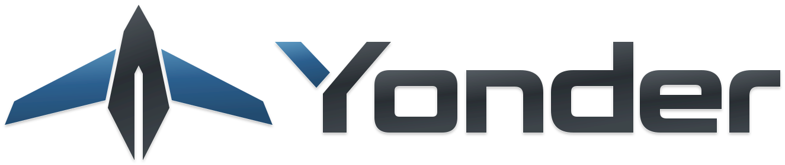
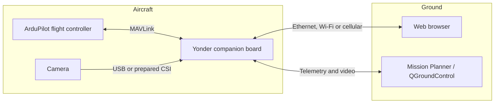

<p align="center">
  <picture>
    <source media="(prefers-color-scheme: dark)" srcset="docs/brand/approved/yonder-night.svg">
    
  </picture>
</p>

<p align="center"><strong>Your aircraft’s instruments, cameras, and connections. One browser.</strong></p>
<p align="center">
  <a href="docs/getting-started.md">Start with a board and SD card</a> ·
  <a href="docs/user-guide.md">User guide</a> ·
  <a href="docs/cockpit-user-guide.md">Flight guide</a> ·
  <a href="docs/hardware.md">Tested hardware</a>
</p>

Yonder is an open-source companion computer for ArduPilot aircraft. It runs on a
small Linux board beside the flight controller, carries MAVLink telemetry and
video over Ethernet, Wi-Fi, or cellular, and gives you a browser-based flight
display and device console. You can also keep using Mission Planner or QGroundControl.

The autopilot flies the aircraft. Yonder displays what it reports and relays the
commands you explicitly review and send. Opening a page, losing a connection, or
reconnecting does not initiate an aircraft command.

**Pre-alpha · CalVer <!-- yonder:version -->2026.9.0<!-- /yonder:version -->.** The combined application has been exercised on
Raspberry Pi 4 and Radxa Zero 3W hardware. Installation currently starts from a
base Linux image; there is no published ready-to-flash Yonder image. Bench and
simulator results are recorded separately from physical flight acceptance.
[Current limits](#current-limits) · [Changes](CHANGELOG.md) · [Versioning](docs/versioning.md)


*The production Flight display in the Yonder console, using synthetic aircraft
telemetry. This is an interface demonstration, not a photograph of a flight.*

## What you can do

**Watch the aircraft.** The Flight page combines a primary flight display,
configurable instruments, mission and moving-map views, terrain, wind, traffic,
and your aircraft’s trail. Inspect a reading’s source and age, plan a mission,
or review a supported aircraft command before sending it.
[Explore the illustrated Flight guide](docs/cockpit-user-guide.md#how-to-use-it).

**Manage the picture.** See a browser preview while serving video to a ground
station. Choose supported codecs, sizes, and rates; use fixed or adaptive video;
and configure camera image controls, recording, and outputs on one page. The
Pocket 2 integration adds native camera controls and guarded pan/tilt. Available
controls follow the attached hardware.
[Camera guide](docs/user-guide.md#cameras-and-video).

**Know which connection is working.** See current interface addresses, default
routes, cellular signal, and ZeroTier controller-path measurements. Run ping,
traceroute, route lookup, and bandwidth tests with their actual output visible.
[Network guide](docs/user-guide.md#network-and-remote-access).

**Keep control of configuration.** Changes that can affect connectivity use
Apply, Keep, and Revert with an automatic rollback deadline. The Wi-Fi fallback
can restore a local way back in when the board has no working path. Settings
holds the console password and Day/Night appearance controls.


*Network · Interfaces in Day mode, captured with a fixture board. Example
addresses describe the fixture, not an installation you should copy.*

## How it fits together



The console and its assets are served by the board. Local use needs no Yonder
account or activation service. Remote access uses a configured ZeroTier network;
external maps, terrain/traffic sources, and the public speed test use their own
network services when selected. Cellular coverage and available bandwidth still
set the limits of the connection.

## Supported and tested hardware

| Hardware | What has been exercised | Start here |
| --- | --- | --- |
| **Raspberry Pi 4 Model B**, 64-bit Raspberry Pi OS Lite / Debian 13 | Network and LTE, MAVLink UART, USB camera video, Pocket 2 integration, combined console and Flight | **Primary getting-started path** |
| **Radxa Zero 3W**, Armbian 26.8.1 / Debian 13, vendor kernel `6.1.115-vendor-rk35xx` | Installation, networking, UART, Rockchip hardware video, SeekerHD CSI/ISP bring-up | Advanced path; OS/network and camera preparation matter |
| **ELP USBGS1200P01-H120**, **DJI Pocket 2**, **Divimath SeekerHD / IMX462** | UVC camera on Pi 4; Pocket 2 through Pi USB gadget mode; SeekerHD on the Radxa vendor kernel | [Camera requirements and measured limits](docs/hardware.md#cameras) |
| **Quectel EC25 / EC25-AF LTE** | ModemManager/MBIM operation, APN setup, signal and connection diagnostics | [Cellular setup](docs/user-guide.md#cellular) |

Other Raspberry Pi, Radxa, camera, modem, and autopilot combinations are **not
validated by this table**. Matching a connector or chipset is not proof of support.
See the [hardware guide](docs/hardware.md) for exact evidence, wiring, cooling,
and the distinction between tested combinations and future targets.

## Start with a board and an SD card

The [complete installation guide](docs/getting-started.md) explains every step,
including finding the board, preparing NetworkManager on Armbian, and recovering
from an interrupted connection. The short Raspberry Pi 4 path is:

1. **Flash the base OS.** Use [Raspberry Pi Imager](https://www.raspberrypi.com/software/)
   to write **Raspberry Pi OS Lite, 64-bit** to the card. Configure a username,
   SSH access, hostname, and your Wi-Fi country. Use Ethernet for the initial
   install when available. Yonder is installed after this first boot.
2. **Boot and connect.** Insert the card, power the Pi from a suitable supply,
   find its address in your router, and SSH in as the OS user you created.
   Confirm `uname -m` reports `aarch64` and `nmcli device status` can see the
   interfaces. [Detailed first-boot checks](docs/getting-started.md#2-boot-the-board-and-find-it).
3. **Build on your computer.** Install Git, Node.js 24 with npm, and a running
   Docker or Podman engine with ARM64 support. In a terminal:

   ```sh
   git clone https://github.com/boydsoftprez/yonder.git
   cd yonder
   npm ci
   npm run build
   ./installer/make-payload.sh --arch linux-arm64 --only node,zerotier,mavlink-router,console
   (cd packages/yonder-core && npm ci --omit=dev --workspaces=false --os=linux --cpu=arm64 --libc=glibc)
   ```

   MediaMTX is staged by the payload script as well. For Radxa hardware encoding,
   build the full payload, including `gst-rockchip`; see the full guide. The board
   still needs access to its OS package repositories for missing system packages.
4. **Copy the prepared tree.** Install `rsync` on the board if necessary. Replace
   `YOUR_USER` and `BOARD_ADDRESS` with the OS account and address from step 2:

   ```sh
   rsync -a --exclude='/.git' --exclude='/node_modules' --exclude='/vendor/capture' \
     ./ YOUR_USER@BOARD_ADDRESS:~/yonder/
   ```

   Keep `vendor/`, every built package, and the core’s **nested** production
   `node_modules`. The excluded top-level `node_modules` is build tooling.
5. **Install on the board.** SSH in, run `cd ~/yonder`, then:

   ```sh
   ./installer/install.sh --dry-run
   sudo systemd-run --unit=yonder-install --remain-after-exit --working-directory="$PWD" \
     /bin/sh -c 'umask 077; exec ./installer/install.sh > /var/log/yonder-install.log 2>&1'
   sudo tail -f /var/log/yonder-install.log
   ```

   The install continues if SSH disconnects while networking changes. Once the
   log reaches `== done`, stop following it with Ctrl-C and check
   `sudo systemctl show yonder-install -p Result -p ExecMainStatus`:
   expect `Result=success` and `ExecMainStatus=0`. Then reboot the board to apply
   its UART/boot changes. [Verification and reconnection](docs/getting-started.md#6-install-and-reconnect).
6. **Open Yonder.** Use `http://BOARD_ADDRESS:3000`, or try
   `http://yonder.local:3000` on the same LAN. For local fallback, join Wi-Fi
   **`yonder`** with **`yonder1234`** and open `http://192.168.77.1:3000`.
   Set the administrator password, then follow the [first-session walkthrough](docs/getting-started.md#7-your-first-session).

The published Wi-Fi passphrase is for initial access. The administrator password
protects the console; it is separate from the OS/SSH account and the access-point
passphrase. There is no default console administrator password.

## Learn and operate

| Guide | What you will find |
| --- | --- |
| [Getting started](docs/getting-started.md) | Board, SD card, base OS, build, install, first login, and troubleshooting |
| [Yonder user guide](docs/user-guide.md) | Status, networks, cameras, telemetry, diagnostics, settings, and everyday workflows |
| [Flight guide](docs/cockpit-user-guide.md) | Illustrated PFD/MFD, instruments, missions, reviewed commands, maps, terrain, and simulator exercises |
| [Tested hardware](docs/hardware.md) | Board/OS combinations, cameras, modem, UART, power, cooling, and evidence |
| [Ground data](docs/cockpit-ground-data.md) | Browser internet, optional aircraft relay, imagery, traffic, and offline terrain packs |
| [Configuration reference](docs/configuration.md) | Advanced settings and the device’s saved configuration |

## Current limits

Yonder is pre-alpha. The code, installer, browser checks, bench records, and
simulator exercises provide different kinds of evidence; they do not establish
flight readiness for an arbitrary installation. Check your own board’s power,
thermal behavior, reboot recovery, link-loss behavior, and aircraft-command path
on the bench before relying on it.

There is no published Yonder disk image yet. Tailscale integration and broader
board qualification remain future work. SeekerHD HDR is not implemented; its
current CSI integration requires board-specific preparation. Browser H.265
playback depends on the browser as well as the encoder. Known defects and
unfinished hardware acceptance remain in the [known issues](docs/known-issues.md)
and [roadmap](docs/roadmap.md).

## Build with us

Yonder is built from TypeScript services, Node-RED adapter packages, and Vue
instruments. Flows connect those pieces; application logic lives in source files
that can be reviewed and tested. Read [Contributing](CONTRIBUTING.md),
[Architecture](docs/architecture.md), and the [requirements](docs/requirements.md).
Report a problem with your Yonder version, board/OS, camera/modem, reproduction
steps, and redacted diagnostic output through [GitHub Issues](https://github.com/boydsoftprez/yonder/issues).

Releases use **`YYYY.M.RELEASE`**, beginning with **`2026.9.0`**. This dates a
release; it does not promise semantic-version compatibility. See
[versioning and upgrades](docs/versioning.md).

## License and acknowledgements

Yonder is [GPL-3.0-or-later](LICENSE), with DCO sign-off for contributions.
It builds on [ArduPilot](https://ardupilot.org),
[mavlink-router](https://github.com/mavlink-router/mavlink-router),
[MediaMTX](https://github.com/bluenviron/mediamtx),
[Node-RED](https://nodered.org),
[FlowFuse Dashboard](https://github.com/FlowFuse/node-red-dashboard), and
[GStreamer](https://gstreamer.freedesktop.org).
Dependencies and separately built components retain their own licenses; the
SeekerHD kernel-driver and ISP source attributions are in its
[bring-up guide](scripts/spikes/seekerhd/README.md).
