# Using the Yonder cockpit

The Cockpit page is the flight display. **YONDER Systems ›** in its header opens
device settings; the cockpit's **Systems** tab inspects telemetry. Cameras retains
capture, stream, exposure and other camera controls. The cockpit
uses the authenticated device session. Opening a panel or editing a local reference
never sends an aircraft command.

## How to use it

Open **Cockpit** in Yonder's navigation after signing in. The development preview
opens the same cockpit directly. Check the source at the top: **SYNTHETIC FIXTURE**
is a display example; **ArduPlane QuadPlane SITL** is a simulated aircraft. A real
board supplies its connected flight controller's data. These screenshots show the
production cockpit with fixture data or the explicitly named simulator; they do
not depict a physical flight.

### 1. Find your way around

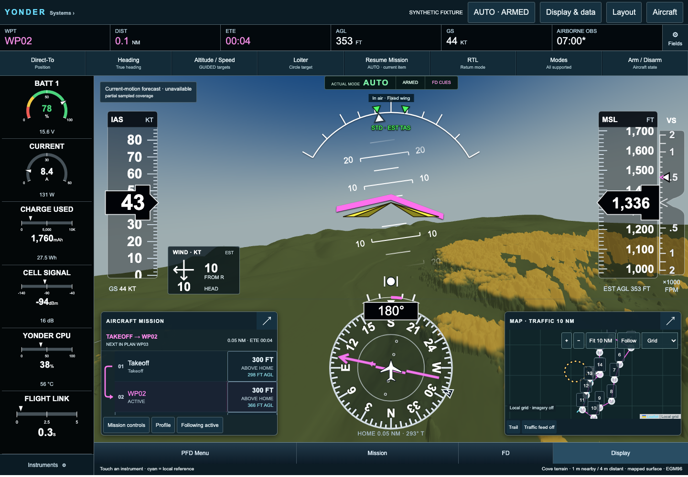

*Production cockpit with synthetic fixture readings. The default keeps one PFD,
navigation fields across the top and graphical instruments beside the PFD.*

- **Navigation fields:** the top readings are configurable through **Fields**.
  Tap a reading to inspect its source, age and recent history.
- **Flight-control strip:** Direct-To, Heading, Altitude / Speed, Loiter, Resume Mission,
  RTL, Modes and Arm / Disarm prepare aircraft requests.
- **Instrument bank:** tap **Instruments** to choose readings and gauge styles;
  tap an individual instrument to inspect it. **Layout** in the header chooses
  the bank's position and the PFD/MFD arrangement.
- **Top-right Aircraft button:** telemetry setup and operation results. After a
  request its text can change to **accepted**, **observed** or another outcome;
  it still opens **Aircraft status**.
- **Lower-left mission:** tap a waypoint's name for its actions, or its altitude
  cell to edit that altitude. **↗** expands the list; **↙** returns to the full PFD.
- **Lower-right map:** **↗** expands it. **Trail** opens our breadcrumbs; the
  traffic-status button opens traffic controls. In the expanded map, **Mission
  actions** opens the same panel as **Mission controls** beneath the mission list.
- **Below the PFD:** **PFD Menu**, **Mission**, **FD** and **Display** open local
  PFD settings. On a narrow screen use the bottom **Mission / Map** selector.
- **Expanded multifunction display (MFD):** **Map**, **Flight plan**, **Systems**
  and **Telemetry** select its page. **×** returns to a single PFD with insets.

Long panels scroll inside the dialog. Close them with **×** or **Escape**.

Tapping a tape or the compass edits a **cyan local reference**. To command the
actual aircraft, use the top strip and its separate **Confirm & send** dialog.

### 2. Connect the instruments and read the aircraft mission

1. Open the top-right **Aircraft** status button.
2. Press **Request flight telemetry**. Wait until the operation finishes; this
   explicitly requests the streams used by the instruments, including optional
   slower sensor reports. An unsupported optional stream is reported; accepting
   a request does not establish that its sensor is present.
3. Press **Read aircraft mission** and wait for **Complete vehicle mission
   downloaded**. The list now represents the mission received from the aircraft.
4. Close the panel with **×** or **Escape**. Check the actual mode, armed state
   and source before using flight controls.

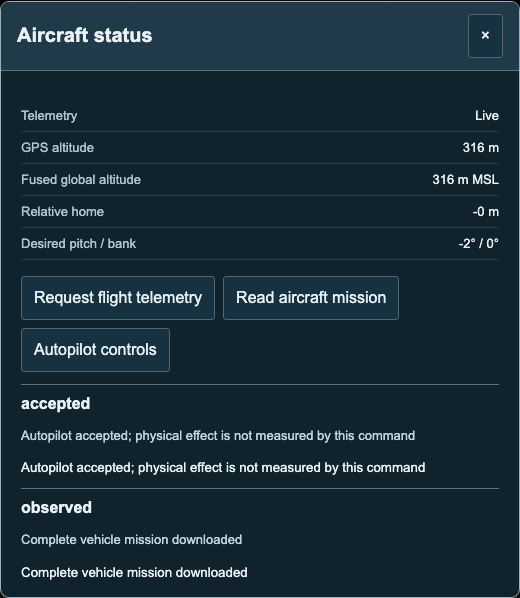

*QuadPlane SITL. Telemetry setup and mission reading do not arm or start it.
Aircraft-status altitude details use their explicitly labeled metres.*

### 3. Arrange the display and choose readings

Press **Layout** in the header to open **Display setup**. The same panel is
available through **Display → Instrument panel & PFD/MFD layout** below the PFD,
or **PFD Menu → Attitude & display → Instrument panel & PFD/MFD layout**.

1. Choose **Screen arrangement**: **Single PFD with insets** is the default;
   **PFD beside MFD** and **PFD above MFD** open a separate multifunction pane.
2. Choose **Instrument panel**: **Beside the PFD**, **Across the top**, **On the
   MFD**, or **Hidden**. If it is on the MFD, open an MFD page to see it.
3. Show or hide **Navigation fields across the top** and the **HOME bearing
   pointer on the HSI**. Choose navigation distance in nautical miles, miles or
   kilometres, and choose **Altitude**, **Speed** and **Vertical speed** units.
4. Changes save in this browser immediately. **Restore display defaults** also
   restores the default field and instrument selections. Tape and HSI transparency
   remain under **Display** below the PFD.

With **PFD above MFD**, each display keeps a readable working height. Scroll down
inside the display area to reach the MFD; the header, autopilot actions and user
fields remain above that area. The instrument bank on the MFD shows its full
faces. **Open map**, **Open flight plan**, **Open systems** and inspecting a
reading bring the selected lower pane into view. Keyboard users can Tab to
**PFD and MFD displays** and use Page Up/Page Down or Home/End to scroll.

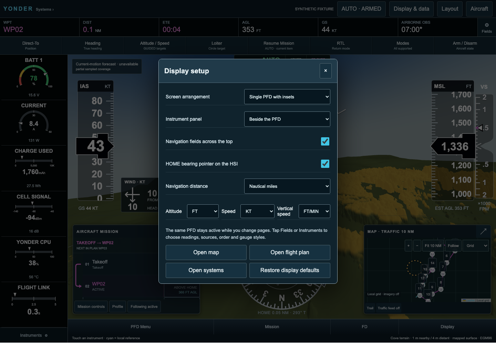

*Synthetic fixture. Layout and units change this browser's presentation; the
aircraft's measurements and autopilot settings stay the same.*

Press **Fields** beside the top readings, or **Instruments** on the bank:

1. Select a numbered slot, or **+** to add one. Search by name, category or source
   using **Find a reading**, then choose an **Instrument source**. Sensor and
   component instances are separate choices.
2. Choose **Presentation**: recommended, numeric field, arc gauge, horizontal or
   vertical scale, elapsed time, bearing pointer, or status indicator.
3. For a graphical scale, set its minimum/maximum and optional color bands.
   **Use source scale** removes those overrides. These limits and bands are local
   display choices; they do not configure aircraft warnings or failsafes.
4. Use **Move earlier**, **Move later** or **Remove** to arrange slots. Press
   **Apply** to save, or **Cancel** to discard this edit. **Restore defaults**
   previews the default selection; press **Apply** to keep it.

Each selection supports up to 16 distinct readings and up to eight nonoverlapping
bands per reading. Invalid scales or bands must be corrected before applying.

The starter bank uses the approved design's bright green/yellow/red scales:
current and CPU arcs, a vertical battery gauge, and horizontal charge, cellular
signal and flight-telemetry-age bars. These are editable presentation presets,
not limits read from your aircraft. Current starts with a 0–30 A scale and charge
used with a 0–8,000 mAh scale; adjust both for your electrical system and pack.
Battery bands begin at 15/30%, current at 22/27 A, charge used at 5,600/6,800 mAh,
RSRP at −115/−105 dBm, CPU at 75/90%, and telemetry age at 0.3/0.7 seconds.
Actual aircraft warnings remain based on reported conditions.

The original untouched gray starter selection upgrades on reload. Custom
sources, order, scales and explicit empty color bands are preserved. To replace
a customized bank with this starter, use **Instruments → Restore defaults →
Apply**. This leaves your top fields and display arrangement in place.

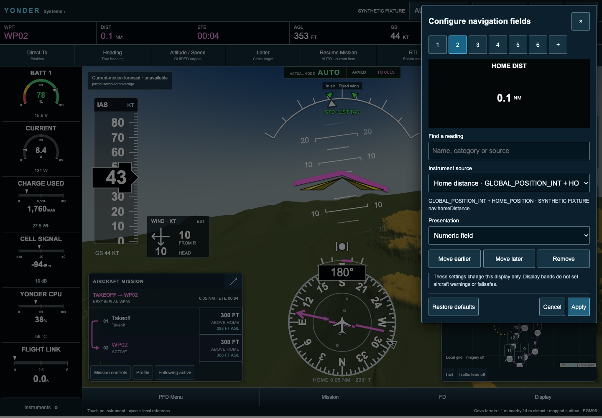

*Synthetic fixture. Navigation fields and the graphical bank have independent
saved selections; both can use any catalog reading.*

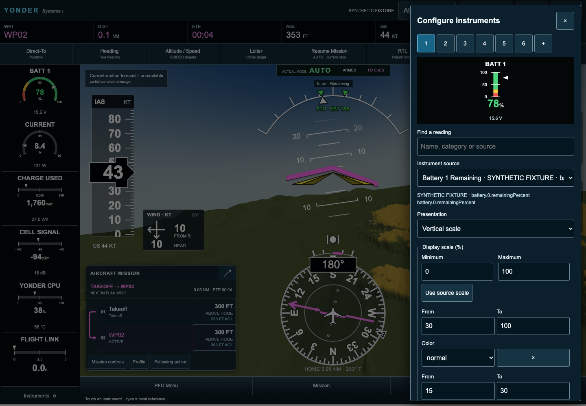

*Synthetic fixture. Display bands are chosen for the example and do not represent
aircraft limits. Unit changes preserve the physical bounds of navigation gauges.*

To explore readings, use **Layout → Open systems**, then search or choose a
category. With the search clear and at least one bank reading selected, expand
**Pinned instruments** below the search for the same graphical bank and saved
configuration used by the PFD; tap a gauge for its detail.
Tap a catalog row for its **Inspector**, or use the MFD's **Telemetry** tab to
search and select a **Telemetry source** directly. The inspector gives the source,
field ID, age, quality, value/unit and unavailable reason, with **Pin to
instruments** and **Pin to navigation fields**. Tapping an already displayed field
or gauge opens this same detail view; it does not open its configuration editor.

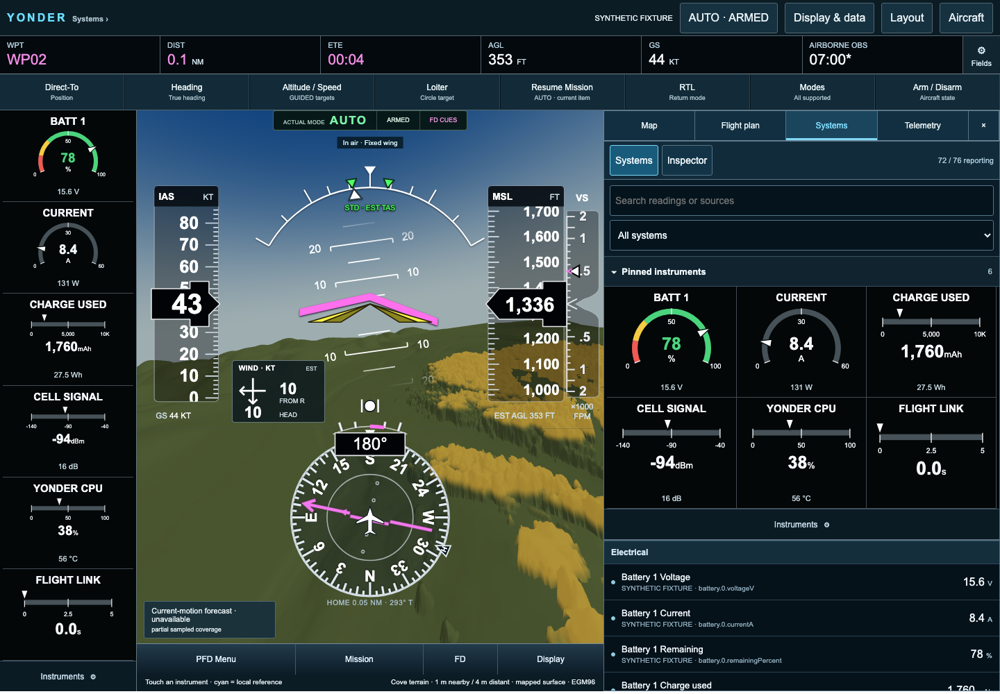

*Synthetic fixture catalog. A source only reports when its required telemetry or
companion service supplies usable data; selecting it does not create a sensor.*

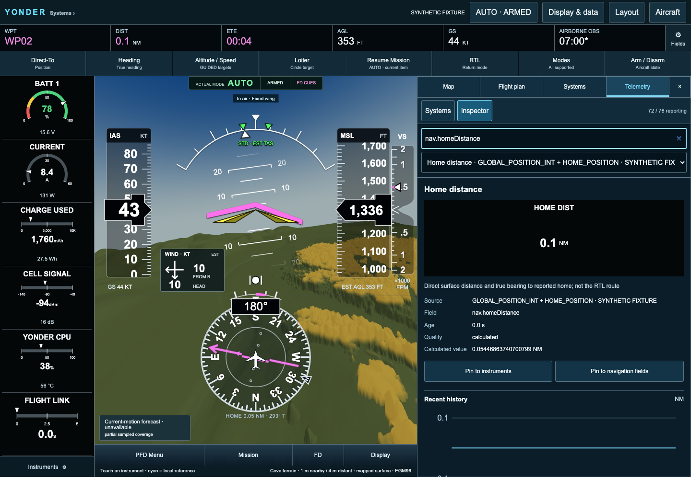

*Synthetic fixture. Recent history shows received numeric samples; blank spans
retain missing data and gaps. Read the source and quality before using a value.*

Press **FD** for V-bar/crossbar director cues. Tap the wind box or skid ball for
their settings. The [instrument reference below](#start-with-the-flight-display)
explains magenta guidance, the cyan references, measured VSI and unavailable data.

### 4. Edit a waypoint or change its action

1. Expand the mission inset with **↗**. Its bracket connects FROM to the active
   destination. **NEXT IN PLAN** describes the next geographic item in the plan.
2. Tap the waypoint's **altitude cell**. Enter the altitude in the selected units
   and choose **Above home**, **Mean sea level (MSL)** or **Above terrain**.
3. Press **Save draft item**. The heading changes to **LOCAL DRAFT**; the aircraft
   is still flying its previously uploaded mission.
4. For a different action, tap the waypoint's **name → Change action**. Search
   for **Loiter Unlim**, for example, then set radius, direction and altitude.
5. Use **Mission controls → Upload draft to aircraft → Confirm & send** when the
   draft is ready. Wait for verified readback, then choose **Show aircraft mission**.

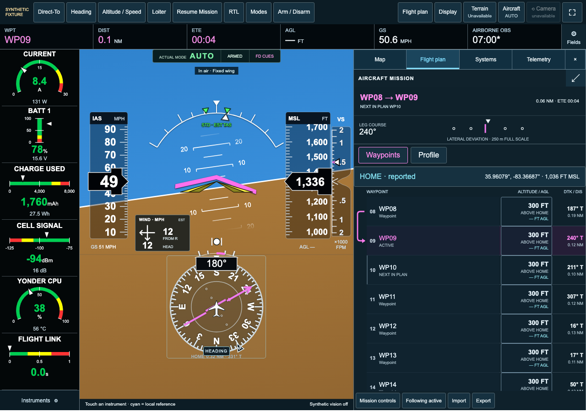

*Fixture AUTO leg WP08 → WP09, followed by WP10. Unavailable waypoint AGL stays
as a dash until compatible terrain is loaded.*

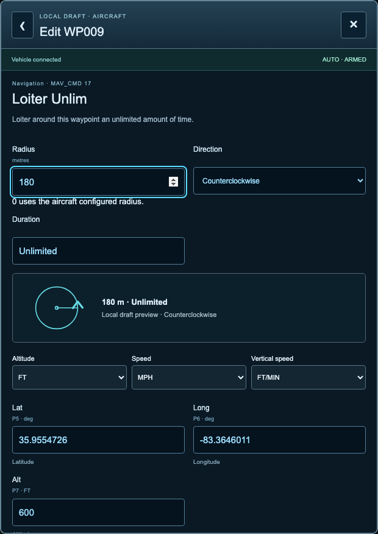

*Local draft example: 180 m counterclockwise loiter. Saving edits the plan only.
Timed loiter uses the aircraft's configured radius; see [loiter forms](#author-a-timed-or-turn-count-loiter).*

Scroll down inside the editor to reach the datum and save controls.

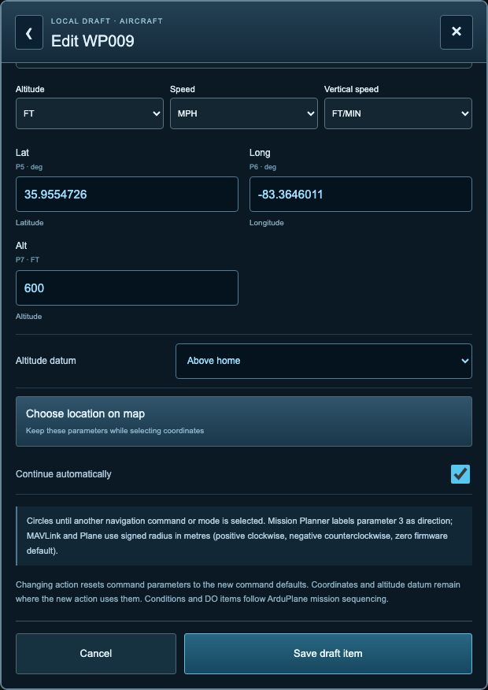

*The same loiter draft, scrolled down. Above-terrain authoring requires suitable
autopilot terrain support when the mission executes.*

To add an arbitrary waypoint, press **Mission controls → Add waypoint on map**,
tap its position, enter altitude/datum, then **Add to draft**. Alternatively,
right-click a map position or hold it for about 650 ms and choose **Add waypoint
here**. Existing edits use **Save draft item**; new items use **Add to draft**.
**Undo edit** reverses a local change. **Export .waypoints** saves your work before
leaving; the draft and its undo history do not survive a page reload.

### 5. Fly to a point or loiter there now

Press **Direct-To → Choose target on map**, then tap a position. Enter altitude
and choose **Above home** or **Mean sea level**. Press **Review Direct-To**, check
the position, altitude and aircraft identity, then **Confirm & send**.

For a circle, use **Loiter → Choose target on map** and also set radius and
direction. An existing aircraft waypoint offers **Loiter at this item…**.
Immediate loiter stays active until another command; duration/turn-count loiters
belong in the mission editor. Immediate targets do not accept above-terrain datum.

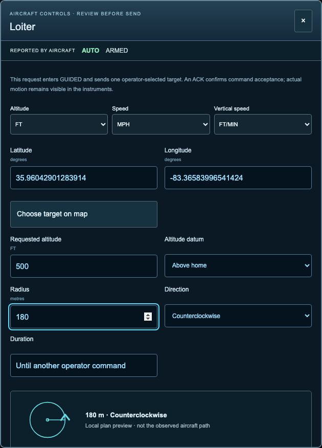

*Fixture form. Radius remains in metres; altitude uses your selected units.*

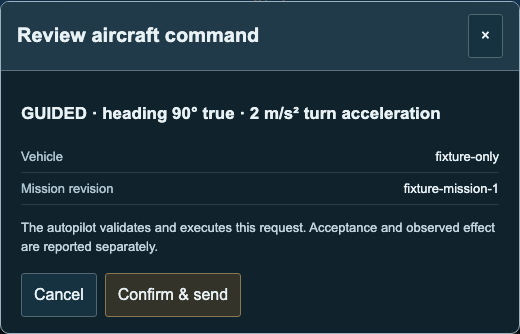

*Fixture heading request. **Cancel** sends nothing. **Confirm & send** submits
one request; read the resulting aircraft state rather than treating acceptance
as proof of capture.*

**Heading**, **Altitude / Speed**, **Resume Mission** and **RTL** follow the same
review step. Altitude and airspeed requests enter GUIDED. They do not edit AUTO
waypoint constraints. A positive vertical-rate entry is a requested magnitude;
**0 requests the aircraft maximum**, not level flight. Nonzero rates are not
reliably followed in the tested firmware. There is no verified VS-hold or
IAS/FLC-climb mode. See [the complete action reference](#request-an-aircraft-action).

### 6. Start the vertical-takeoff demo

Use **ArduPlane QuadPlane SITL** for this exercise. After requesting telemetry
and reading the mission:

1. **Display & data → Load VTOL cove example as local draft**.
2. **Mission controls → Upload draft to aircraft → Confirm & send**. Wait for
   verified readback.
3. **Mission controls → Show aircraft mission**. This closes the panel; reopen
   **Mission controls**. Its heading must no longer say **LOCAL DRAFT**.
4. Select **QLOITER → Confirm & send**. Reopen **Mission controls**.
5. Wait for the simulator's EKF3 and GPS to be ready. Then **Arm aircraft →
   Confirm & send**, and wait until the actual state is **ARMED**. Normal prearm
   checks remain enabled. If arming is refused, read the aircraft's status message
   and wait for readiness. Reopen **Mission controls** after arming succeeds.
6. Press **Start aircraft mission**, directly below Arm/Disarm and above the
   mode grid, then **Confirm & send**.

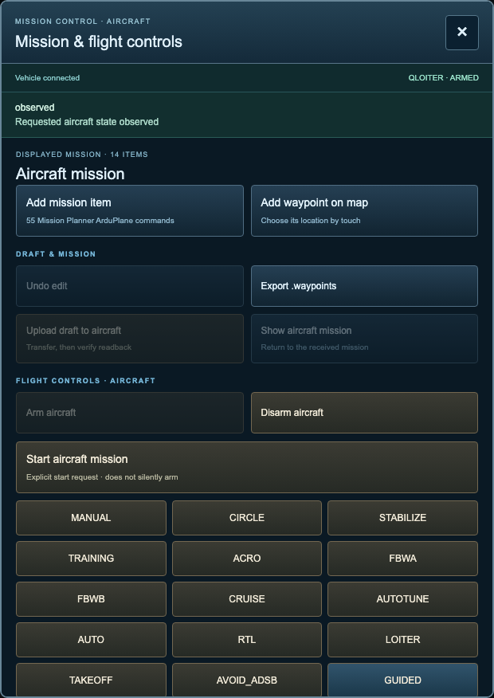

*QuadPlane SITL, armed, displaying the verified aircraft mission. This is the
panel containing the Start button; the top strip's Resume Mission is another workflow.*

Expected: actual mode becomes **AUTO**, height and measured VSI increase, then
item 01 completes near **180 ft above the takeoff point** and item 02 becomes
active. The aircraft transitions and continues toward the 300-ft-above-home
route. The [full VTOL notes](#vertical-takeoff-in-the-quadplane-simulator) explain
transition timing and why the example has no automatic landing. In flight, use
**Resume Mission** or **Continue AUTO from this item** to resume a route waypoint;
restarting item 01 can request another climb above the current takeoff reference.

### 7. Inspect terrain below the plan

Enable terrain and configure a ground source as in step 8. Press **Profile**
beneath the mission inset, or its **Profile** tab when expanded. Move **Inspect
along route** to read estimated AGL and height above mapped surface. Choose a
waypoint in **Inspect waypoint** and use **Edit waypoint altitude** to change it.

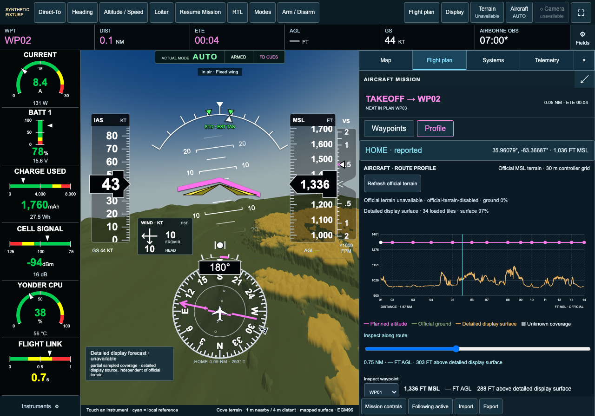

*Synthetic flight plan over the actual USGS 2016 Cove pack. Magenta is planned
altitude, green is ground and amber is mapped surface. This samples the route
centreline; it does not model climb capability, turns or every obstacle.*

**Plan MSL datum** must agree with the source. Unknown or incompatible references
remove the clearance calculation. Read ground and mapped-surface coverage
separately; a gap does not mean clear terrain. See [profile details](#flight-planning-profile).

### 8. Set up terrain, satellite imagery and traffic

Open **Display & data**, then **Connection & offline data**:

1. Keep **Public data connection → Ground browser internet** to use your laptop
   or tablet's internet. Its network route must actually be ground internet.
2. For detailed prepared terrain or providers that reject direct browser access,
   enter your ground service in **Optional ground relay origin** and press
   **Apply ground relay**. A tablet needs a reachable HTTPS ground service;
   `127.0.0.1` identifies the tablet itself.
3. Scroll down and enable **terrain data**, **hybrid imagery data** and/or
   **internet ADS-B traffic**. These are separate switches. Choose **Hybrid** or
   **Satellite** on the map when imagery is enabled.
4. Prepare offline data before flight: turn **Enable terrain data** off, then
   **Preload terrain from ground relay** or **Import terrain folder**. Wait for the
   saved-package result, select **Offline browser packs**, and enable terrain again.
   Prepared terrain validation requires HTTPS or localhost. After reloading,
   reselect **Offline browser packs**; a newly opened cockpit starts in Ground mode.

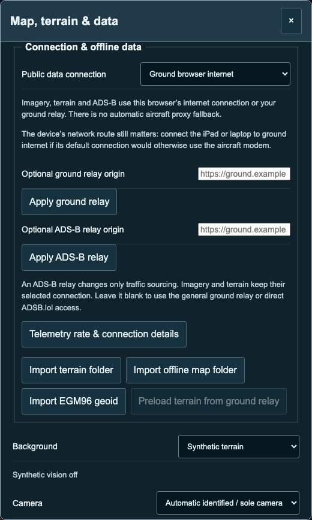

*Fixture controls. The panel scrolls; source switches, imagery, forecast and
import controls are farther down. Ground setup has no automatic aircraft fallback.*

Tap the **traffic-status button below the map**. Enable the feed, choose a
**Display range** such as 5 NM and an **Observed trail** duration. **Fit 5 NM** on
the map frames that range. Map-only targets need compatible geometric height and
geoid conversion before they can appear ahead in synthetic vision.

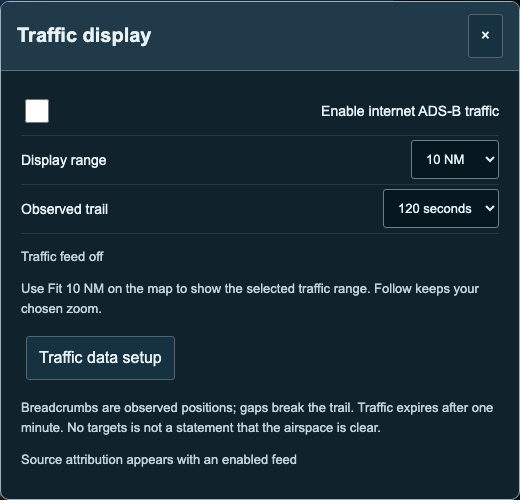

*Fixture settings, feed off in this capture. The screenshot is not evidence of
live traffic availability. Real provider errors, rate limits and target expiry
remain visible. See [ground-data setup](cockpit-ground-data.md).*

For our own path, press **Trail** below the map. Select **Last X minutes**, **Last
X miles** or **Since power-on**. **Clear displayed trail** hides earlier observations
in this browser; **Restore recorded trail** makes retained observations visible again.

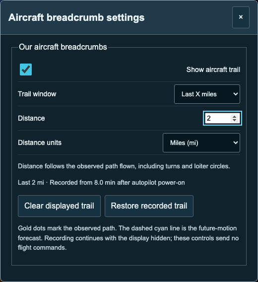

*Fixture recorded path. These are display controls; they do not erase the
recorder or send a flight command.*

### If a control is unavailable

| What you see | What to check or do |
| --- | --- |
| Start aircraft mission is grey | If the heading says **LOCAL DRAFT**, upload and verify, choose **Show aircraft mission**, then reopen Mission controls. Read the aircraft mission first if none is available. |
| Buttons briefly disable after a command | Wait for fresh aircraft details and the pending operation. The panel explains when details are refreshing. |
| No instruments / FLIGHT DATA UNAVAILABLE | Check the source and connection; use Aircraft status → Request flight telemetry. Do not interpret missing measurements as zero. |
| A gauge or category is unavailable | Tap it and read its source, age and reason. Optional reports require the corresponding firmware, sensor or companion service; Request flight telemetry cannot supply absent hardware. |
| Fields or graphical instruments have disappeared | Open **Layout**, enable **Navigation fields across the top** or change **Instrument panel** from Hidden. For **On the MFD**, open an MFD page. |
| A timer ends with `*` | It has partial observed history. Inspect it for late attachment, clock handoff or excluded telemetry gaps; it is not a complete flight log. |
| Arming is refused during the simulator demo | Wait for EKF3 and GPS readiness and inspect the reported prearm reason. Keep the normal autopilot prearm checks enabled. |
| Heading, altitude, speed or radius unavailable | Those extended GUIDED controls require a fresh supported ArduPlane 4.7.1 identity. Opening Modes does not prove every optional feature is available. |
| Accepted, but no HDG/ALT capture announcement | Acceptance is an ACK. These controls have no verified capture annunciation; inspect actual mode, measured motion and Aircraft status. |
| Request times out or says unknown | Inspect actual aircraft state before deciding to repeat it. The browser does not retry a flight command automatically. |
| Terrain is flat or EST AGL is a dash | Check terrain enabled, source/pack coverage, fresh position and verified compatible height datum. The conventional horizon is still useful without terrain. |
| Waypoint AGL or profile clearance is a dash | Load compatible prepared terrain. Above-home altitude alone does not establish remote AGL; surface coverage can be missing while ground is present. |
| Traffic is enabled but empty | Read the traffic-status message and selected range. A provider/browser error may require a ground relay. HTTP 429 waits for cooldown. No targets does not establish clear airspace. |
| Traffic appears only on the map | Geometric height/geoid conversion, ownship datum or forward field of view may be missing. Import the EGM96 grid through Traffic data setup when applicable. |
| Skid ball, wind or director disappears | Open its settings for the missing/stale-data reason. Visibility can also be restored from **PFD Menu**. |
| Camera is unavailable / registration unavailable | Select a detected camera and start its stream in Cameras. Use **Use synthetic terrain** for the terrain background. Registered annotations also require physical calibration and capture-time pose; those are not supplied by these screenshots. |

The [walkthrough verification record](console/evidence/2026-09-08-cockpit-telemetry-layouts.md)
lists the checks performed, fixes found and limits that still need hardware or
live-provider evidence. Detailed explanations follow below.

## Start with the flight display

The default view keeps one PFD visible, with a mission inset at the lower left,
a map/traffic inset at the lower right, top navigation fields and a graphical
instrument bank. Press either inset's expansion arrow for a larger multifunction
pane alongside the same PFD. **Layout** also offers a PFD above the MFD. The MFD
tabs open the map, flight plan/profile, systems catalog or telemetry inspector.
Its **×** restores the single PFD with insets. On smaller screens, a side bank
moves across the top; narrow screens provide a Mission/Map selector and stack an
expanded pane below the PFD. Stacked displays keep their own heights and scroll
beneath the top controls. The scene fills its PFD viewport. The tapes move toward its edges while
the attitude reference, VSI, HSI circles and director retain a uniform scale; touch
regions follow those positions. Insets remain below the primary tape scales.
Keyboard Tab reaches controls; Escape dismisses an open panel.

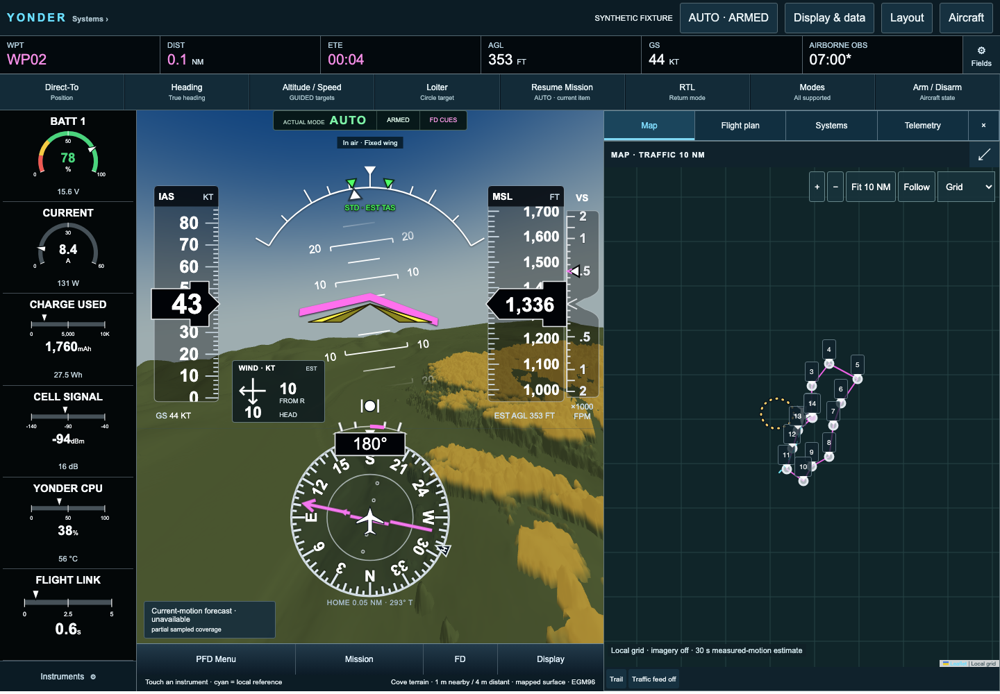

*Synthetic fixture with **PFD beside MFD** selected. Changing the MFD page keeps
the same PFD active and preserves the map instance.*

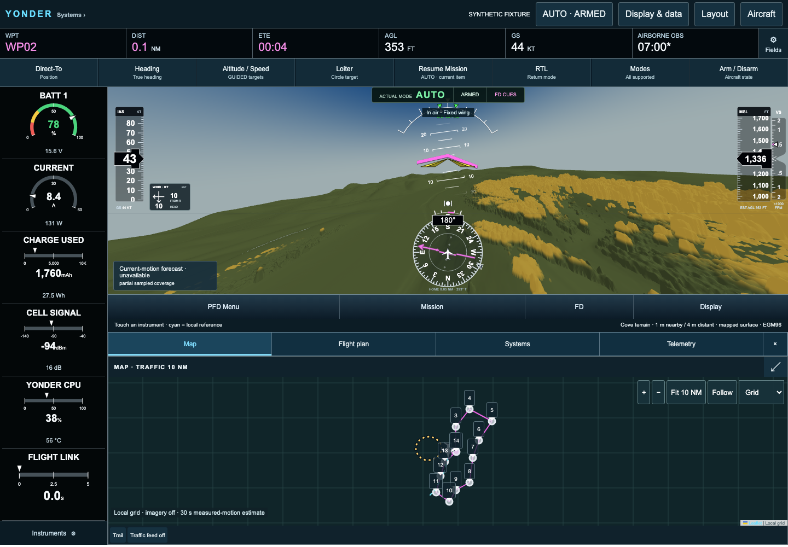

*Earlier compact arrangement specimen. The current **PFD above MFD** layout
keeps full-height displays with vertical scrolling. **Single PFD with insets**
remains the default.*

The persistent control strip provides **Direct-To**, **Heading**, **Altitude /
Speed**, **Loiter**, **Resume Mission**, **RTL**, **Modes**, and **Arm / Disarm**.
It wraps to two rows on smaller screens. Opening these controls only prepares an
operator request; the separate review and confirmation still apply.

The top-center annunciator shows **ACTUAL MODE** and the reported armed state.
Its mode and arm controls open separate pickers. **FD CUES**, **FD NO DATA**, or
**FD OFF** describes the director display, not a heading or altitude capture mode.
Requested actions and their outcomes remain distinct from that actual mode.
An accepted GUIDED request does not change the displayed mode until fresh aircraft
telemetry reports the change. An unavailable mode is stated rather than retained
as current. Aircraft status contains the complete operation messages.

The tapes default to indicated airspeed in knots and reported MSL altitude in feet.
The VSI defaults to measured climb in feet per minute. These units are selectable
in **Layout**, **Display** below the PFD, or the **Altitude / Speed** controls.
Choose **KT / MPH / m/s**, **FT / M**, and **FT/MIN / m/s** independently.
Changing units preserves the physical value and saves locally. The HSI heading is true north. Magenta
flight-director cues show the autopilot's reported desired pitch and bank, and
remain unavailable when those measurements are absent. Choose V-bar or crossbar
cues from FD settings. The numeric VSI and pitch/bank summaries remain in split
views; the full view uses their primary instruments to leave room for the insets.

Tap airspeed, altitude, heading or the VSI to enter a **local reference**. Cyan
marks are local display references. Sync live copies a current reading into that
reference; it is not a command. Display & data selects day/night palette, tape and
HSI transparency, background and optional sources. The PFD remains screen-fixed
over a camera image even when scene registration is unavailable.

The autopilot action buttons sit directly below the cockpit header, above the
configurable user fields. This order is the same in side-column and top-strip
layouts, including keyboard navigation. Graphical gauges scale their titles,
faces and secondary readings together to fill their allocated instrument space.

The default top fields are active waypoint, waypoint distance, ETE, estimated
terrain AGL, ground speed and observed airborne total. The default bank shows battery 1
current, remaining charge, charge used, cellular signal, Yonder CPU utilisation
and flight telemetry age. **Fields** and **Instruments** configure these selections;
**Layout → Instrument panel** chooses placement. Expand the mission pane to see
the preserved lateral-deviation scale: its white center triangle stays fixed while
the magenta bar uses the same guidance and full-scale setting as the HSI. GUIDED
loiter labels radial OUT/IN error; unavailable guidance removes the bar.

Missing or expired measurements show unavailable indications. GPS altitude,
fused global altitude and height above home are separate readings in Aircraft
status. Navigation-controller cross-track, mission-current information and GUIDED
targets have their own freshness checks. AUTO straight-leg CDI and GUIDED loiter
radial error are different indications. ETE means estimated travel time to the
point; it is not a turn countdown.

During **AUTO**, the aircraft mission inset shows **FROM → TO**, highlights the
reported active item in magenta and marks the **NEXT** geographic item. **NEXT IN
PLAN** means the uploaded order; it skips ordinary action items but stops at a
mission jump or return command instead of guessing what the autopilot will do.
A local draft is labeled separately and has no aircraft-active badges.

The list brings the active item into view as the aircraft advances. Scrolling or
touching the list pauses that behavior so you can browse. Press **Follow active**
at the bottom to resume; the button reads **Following active** while enabled.
Expand the mission inset to see the larger lateral-deviation scale beside the PFD.
These list controls only change this browser's display.

For an AUTO waypoint leg, the HSI course arrow uses the uploaded **FROM → TO**
course. ArduPlane's steering bearing varies while capturing the path and is not
the leg course. The magenta needle in both displays uses the autopilot's measured
cross-track error and points toward the correction. At a waypoint handoff, the
needle waits for telemetry whose sequence, target and path agree with the new leg.
Distance and bearing remain available while lateral guidance is unavailable.
An external rejoin or mission jump can produce a path with a different origin;
the cockpit shows target bearing only until the uploaded leg can be verified
against telemetry, rather than inventing a commanded course.

The waypoint table draws a magenta bracket from the preceding item to an arrow
at the active target. Following keeps both adjacent rows visible when there is
room. The expanded table has **ALTITUDE / AGL** and **DTK / DIS** columns. DTK is
the planned true course; distance is that leg's length, while the summary retains
the aircraft's current distance and ETE to the active target.

Tap the altitude cell beside a waypoint to open its draft editor directly. Enter
the altitude in the selected units and choose **MSL**, **Above home**, or **Above
terrain**. **Save draft item** changes the local plan; **Mission controls → Upload
draft to aircraft** still requires review and confirmation. Mission speed-command
fields also use the selected speed units. Other mission parameters retain their
explicit catalog units. A missing altitude reads **— FT** or **— M**; it is never
filled with zero. The smaller **AGL** value is estimated from the terrain pack
at that waypoint, separate from the authored altitude datum.

During a GUIDED heading request, ArduPlane continues transmitting its previous
geographic target. The cockpit suppresses that target's bearing, distance, ETE
and CDI instead of presenting it as the commanded path. Measured flight-director
pitch/bank remain available. A later accepted Direct-To/Loiter with matching
fresh target coordinates restores geographic guidance; actual AUTO restores
mission navigation. Missing request history and external heading overrides are
explicit limitations of GUIDED ownership, not evidence of an active waypoint.

## Telemetry catalog, sources and flight time

**Systems** groups received readings into the following categories. Search matches
names, field IDs and source descriptions. Each sensor/component instance remains
separate: for example, individual battery reports and the flight controller's
battery summary do not become one battery. A family that has never been received
does not produce invented readings; representative unavailable entries explain
missing sources. The catalog is bounded and reports when readings are omitted.

| Category | Readings and required sources |
| --- | --- |
| Navigation | Active waypoint, distance/ETE, desired track and lateral deviation; reported IAS/ground speed and height above home; calculated home distance/bearing/relative direction, remaining planned distance and recorded ground-track distance. These require fresh flight telemetry and, where applicable, verified mission geometry, reported home, retained trail or compatible terrain. |
| Flight time | Flight-controller power-on time and observed armed, airborne and AUTO-execution totals. They use reported boot, heartbeat and landed-state messages; see the counter rules below. |
| Electrical | Per-battery voltage, current, remaining charge, consumed mAh/Wh, temperature, remaining time, charge state and fault flags, plus the independent system battery summary. The flight controller needs configured battery monitors and must report each supported field. |
| Propulsion | ESC temperature, voltage/current, charge used and reported RPM; separate RPM sensors; engine/EFI health, RPM, fuel, pressure, temperature, throttle and ignition readings; generator power, current, voltage, temperature, runtime and maintenance time. These require the corresponding ESC, RPM, EFI or generator telemetry and firmware support. |
| Navigation health | Separate GPS fix, satellites, coordinates, altitude, speed/course, accuracy and dilution readings; estimator flags, ratios, variances and accuracy. Each depends on its GPS or estimator report; a second receiver is not assumed. |
| Terrain | Rangefinder/distance-sensor measurements, orientation, limits and signal/variance; flight-controller terrain elevation, clearance, grid spacing and block counts. A downward range sensor, aircraft terrain report and browser terrain estimate remain distinct sources. |
| Aircraft state | Reported mode, armed state, landed state and VTOL state. VTOL transition labels require the autopilot's explicit state report; altitude or speed does not determine a transition. |
| Controller health | Flight-controller scheduler load, sensor presence/enabled/health flags, memory, communication/error counts, board/servo power, MCU temperature/voltage, vibration and IMU clipping. MCU measurements require hardware-monitor support; they are separate from the companion board's temperature and CPU use. |
| Fence & alerts | Reported fence breach, breach count/type/time and mitigation. A missing fence report does not establish that no breach or alert exists. |
| Links & controls | Flight telemetry age; aircraft modem signal/state/operator/technology; telemetry-radio signal/noise/errors and transmit buffer; RC signal/channels and raw servo outputs. Modem data comes from the companion's modem service; RC/output/radio fields require their aircraft messages. Raw radio signal units remain raw and do not indicate throughput. |
| Payload | MAVLink camera identity/capabilities, image/recording and camera-storage reports; gimbal attitude, rates, flags and failures; companion camera pipeline and recording state, duration, bytes, destination and remaining-time estimate. Camera/gimbal telemetry, configured companion pipelines and the recorder are separate dependencies. |
| Yonder system | Companion CPU utilisation, board thermal sensor, memory use/total/available, uptime and recording-medium free storage. These use the companion operating system; unsupported OS readings remain unavailable. |

The inspector's **Source**, **Field**, **Age**, **Quality** and **Reported value**
identify what you are viewing. Aircraft sources retain MAVLink message, system
and component identity; companion sources begin **Companion**. Browser calculations
state their input sources. A calculated navigation or gimbal value is shown in its
displayed units; inspect its underlying catalog readings for the reported inputs.
Do not read **Yonder CPU utilisation** as flight-controller load, **Yonder Uptime**
as autopilot boot time, or a companion recording as MAVLink camera recording.
Browser video/network behavior does not measure onboard CPU or recording state.

Gimbal roll, pitch and yaw can be calculated from a fresh, valid reported attitude
and its frame flags. Yaw labeled **°T** is referenced to true north; **° REL** is
relative to vehicle heading. The raw quaternion, angular rates and frame flags
remain inspectable. An invalid or ambiguous frame suppresses the calculated
orientation. These readings do not establish camera calibration or scene registration.
ESC RPM interpretation is described with its source; no extra pole-count conversion
is assumed. Unsupported or ambiguous zero ESC values remain unavailable. Vibration
and telemetry-radio fields retain raw units where no physical unit is established.

Readings expire independently. A fresh battery value does not refresh an old
temperature or GPS report. A dash, missing pointer or unavailable reason means the
measurement cannot currently be used; it is not a measured zero. **Quality** can be
reported, calculated, partial or unavailable. **Recent history** displays up to 120
numeric samples; missing readings and gaps stay blank. History is a short browser
view and begins again after reload or a changed aircraft; it is not a flight log.

The slower instrumentation read runs separately at up to **1 Hz**. Opening the
catalog, pinning a value, changing a layout or polling readings sends no aircraft
command and does not start cameras or recording. **Aircraft → Request flight
telemetry** is the explicit stream-configuration action. Optional sensors may
still be absent or their interval requests may be unsupported. The **Display &
data** bandwidth line separates fast flight and instrumentation JSON payloads;
it excludes HTTP overhead, video and public data.

### Interpret the counters and navigation estimates

- **Power-on time** is the flight controller's latest reported boot timestamp.
  `SYSTEM_TIME` can supply it initially; once `GLOBAL_POSITION_INT` supplies a
  valid boot timestamp, that message is the clock authority. If it stops, the
  reading expires rather than switching back to a competing clock. The number
  is not extrapolated between reports.
- **Observed armed total** adds intervals bracketed by fresh armed heartbeats.
  **Observed airborne total** adds intervals bracketed by explicit **IN_AIR**
  reports with fresh heartbeat context. It excludes TAKEOFF, LANDING, transition
  boundaries and gaps, so it is not a complete takeoff-to-landing flight timer.
  **Observed AUTO execution total** counts fresh armed AUTO intervals and pauses
  in other modes. These totals accumulate across arm cycles until the collector
  or confirmed boot history resets; they are not elapsed time for one sortie.
- A trailing **`*`** means partial observed history. Attachment after boot or
  takeoff cannot recover earlier time, and gaps are excluded. Browser reloads
  retain service-side counters; a service restart starts new partial history.
  An observed autopilot reboot or a changed reported hardware identity resets
  them. A source-clock handoff can leave preceding continuity unverified; the
  inspector gives the reason. Without a reported hardware ID, reused vehicle
  IDs cannot prove physical-device continuity.
- **HOME** on the HSI and home fields use direct surface distance and bearing
  from fresh aircraft and reported home positions. They do not describe the
  autopilot's RTL route, target altitude or obstacle clearance. Bearing is
  undefined at home. **Height above home** is independent of terrain AGL.
- **ETE** uses current progress toward the active point. **Remaining planned
  distance** sums resolvable straight plan legs and becomes unavailable at an
  unresolved loiter, return or jump. It excludes turns and climb/landing paths.
  **Recorded ground-track distance** has partial observed history, including
  late attachment and gaps; it is separate from planned distance.

The header's **NOTICES** button remains available when the bank is hidden.
It opens **Aircraft notices**, with current reported sensor-health, battery, fence
and VTOL conditions plus recent aircraft status messages. **Inspect reading**
opens a structured source where applicable. Status messages are historical reports;
they do not by themselves establish that a condition is still active.
These reports do not use your local gauge color bands, and their absence does
not establish complete aircraft health. Yonder never sends an automatic aircraft
command in response to a reading or notice.

## Altitude, airspeed and climb requests

Use **Altitude / Speed** on the persistent strip:

1. Under **Altitude**, enter a target altitude and choose **Above home** or **MSL**.
2. Enter a positive **Requested climb / descent rate** magnitude in **FT/MIN** or
   **m/s**. The target's relation to current altitude determines climb or descent.
   Zero requests the aircraft maximum within its configured limits.
3. Under **Airspeed**, choose **KT**, **MPH** or **m/s** and enter the requested speed.
4. Review the request, then confirm separately to transmit it. These controls enter
   GUIDED; they do not rewrite an AUTO mission's waypoint altitudes.

ArduPlane 4.7.1 accepted a nonzero vertical-rate command in the retained simulator
test but climbed much more slowly than requested. The panel states this limitation;
it does not claim VS hold. Likewise, changing requested airspeed is not a verified
IAS/FLC climb mode. The aircraft manages speed and height together, and the measured
VSI shows what it actually does. No firmware modification or browser flight-control
loop is introduced. See the [protocol evidence](console/evidence/2026-09-07-flight-control-protocol.md).

## Flight-planning profile

Press **Profile** at the bottom of the mission inset, or expand the inset and
select its **Profile** tab. The PFD remains visible. The chart shows magenta planned
altitude, green ground and an amber mapped-surface line. Move **Inspect along route**
to read estimated AGL and clearance over mapped surface between waypoints. Select
a waypoint on the chart or in the picker to see its altitude and edit it.

The profile uses native prepared terrain from the selected source. It loads a
bounded route sample set in the background for waypoint AGL, retains decoded tiles,
and recalculates after edits or source changes. The ground browser/source supplies
these data by default. With aircraft-proxied terrain selected, press **Load route
terrain from aircraft** explicitly; the profile does not start that transfer merely
because the page opened. There are at most 192 native tiles, 32 MiB decoded tile
cache, two concurrent tile requests and 2,048 route samples per calculation.

Check **Plan MSL datum** before comparing an imported plan with terrain. The default
uses the aircraft's configured height reference; an unknown or mismatched reference
removes calculated clearances. Source and survey details are expandable below the
chart. Ground and surface coverage are reported independently. A missing surface
sample means unknown obstacle clearance even when ground elevation is present.

This is a sampled centreline planning view. Ordinary legs interpolate waypoint MSL
altitudes; a pair of terrain-relative waypoints interpolates their ground offset.
Climb performance, turn arcs, loiters, return/landing paths and unresolved mission
jumps are not predicted. Visible limitations identify omitted geometry and sample
or load limits. Gaps remain gaps; small objects between samples and obstacles absent
from the survey are not established clear by this view.

## Slip / skid ball

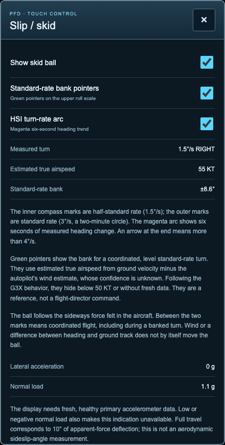

*Fixture measurements. The controls independently show or hide the ball, bank
reference pointers and compass turn-rate arc.*

The white ball immediately above the HSI heading readout shows the sideways force felt in the
aircraft. In coordinated flight it stays between the two center marks, even
while banked. Wind and a difference between heading and ground track do not by
themselves move it. Tap the ball, or use **PFD Menu → Slip / skid**, to inspect
its source measurements or hide it. **Display → Slip / skid ball settings**
restores it when hidden.

The ball uses calibrated primary ArduPlane accelerometer readings and their
reported health. It disappears with **SLIP / SKID —** when flight data, sensor
health or fresh acceleration is unavailable. Data expires after two seconds;
low or negative normal load also makes this conventional indication unavailable.
**Aircraft → Request flight telemetry** includes these readings at 5 Hz.
Movement is smoothed over 180 ms; travel is bounded at an apparent-force angle
of ±10°. That is the display's scale, not an aerodynamic sideslip angle.

The same touch panel controls **Standard-rate bank pointers** and the **HSI
turn-rate arc**. Green triangles on the upper roll scale show the bank required
for a coordinated, level 3°/second turn. They are labeled **STD · EST TAS** because
true airspeed is estimated from ground velocity minus the autopilot's wind vector.
They hide below 50 KT estimated TAS or when either input expires.
The panel gives the current estimate and the reason when unavailable. WIND does
not carry estimator confidence; this is not a directly measured TAS indication.

Above the compass, the inner white marks indicate 1.5°/second and the outer marks
3°/second (a two-minute circle). The magenta arc depicts six seconds of measured
heading change; its end arrow indicates more than 4°/second. It uses attitude and
body rates converted into heading rate, rather than body yaw rate alone. Missing
data shows a steady **TURN —**. These references are separate from the magenta
flight director's commanded attitude. Their visibility settings save locally.

Both cues use already received MAVLink messages; no additional aircraft streams
or public data downloads are needed. Older telemetry servers require an update
to supply these optional compact fields.

## Wind on the PFD

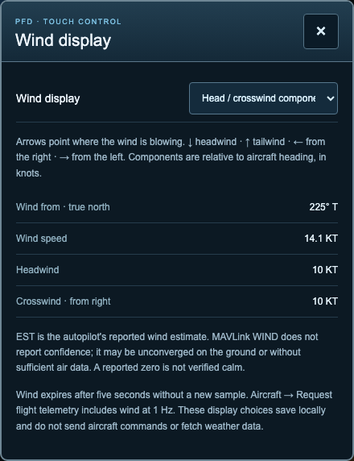

*Fixture wind estimate. This diagnostic panel explicitly labels its values in KT;
the wind box on the PFD follows the selected speed units.*

The wind box sits beside the lower part of the airspeed tape, above the mission
inset. Its default view shows headwind/tailwind and crosswind components in knots,
relative to the aircraft's true heading. Arrows point where the wind is blowing:
**↓ headwind**, **↑ tailwind**, **← from the right**, **→ from the left**. The box uses your selected speed units; its default is knots. Values
round for display; an arrowhead disappears when its component rounds to zero.

Tap the box, or use **PFD Menu → Wind** or **Display → Wind display settings**.
Choose components, wind arrow and speed, direction/arrow/speed, or off. The direction
view reports the bearing the wind comes **from**, labeled **° T** for true north.
Settings save on this browser and never issue a flight command.

**EST** identifies ArduPlane's MAVLink `WIND` estimate. This message contains no
confidence flag; a fresh report can still be unconverged on the ground or without
sufficient air data. A reported zero is not verified calm. Missing/invalid data,
a sample at least five seconds old, or unavailable heading/flight telemetry shows
**NO WIND DATA** and removes the arrows. Wind from another vehicle is never used.

**Aircraft → Request flight telemetry** now requests `WIND` at **1 Hz** after the
existing flight stream requests. No stream changes occur on page load or reconnect.
Wind travels in the compact flight response as three numbers (bearing, speed and
sample age). It uses no weather API or public-data proxy. Older services that do
not publish this field show **NO WIND DATA** until their core is updated.

## Read and author a mission

1. Open Aircraft status and press **Read aircraft mission**. A verified transfer
   supplies the aircraft mission and its revision, including ArduPilot's home
   record. The authored list excludes that home row explicitly.
2. Open **Mission controls**, or select a route point on the map. The 55-command
   Plane catalog supports search and Navigation, Condition and Action categories.
   Each form carries parameter names, units, enum choices and firmware notes.
3. Select an item and choose **Edit parameters** to change its existing action's
   fields, or **Change action** to choose another command. For example, choose
   **Change action → Loiter Unlim**, enter its radius and direction, and press
   **Save draft item**. Changing action retains the item's sequence identity and
   geographic values where the new action uses them. Incompatible command
   parameters reset to the new command's defaults; an acceptance radius does not
   silently become a loiter radius. Review the new form before saving.
   Changing a relative-altitude item to **Do Set Home** clears its altitude and
   requires a new MSL value; the previous height is never relabeled as MSL.
   Edit, insert, move or remove items to create a **LOCAL DRAFT**. Undo restores the
   previous edit. Changes are local until an explicit upload. DO_JUMP targets are
   remapped when items move; removing a referenced target requires resolving the
   jump first. Imported unknown commands remain inspectable and exportable.
4. Import Mission Planner WPL `.waypoints` or QGroundControl SimpleItem `.plan`
   files through Display & data. ComplexItem plans are rejected with a reason.
   The file limit is 2 MiB, and the aircraft transfer limit is 2,000 wire items,
   including home. Export saves a WPL file. Export drafts before leaving or
   reloading the page; draft and undo history are held in this browser session.
5. **Load cove example as local draft** explicitly selects the included
   “Take off around the cove then land” mission: its home and fourteen original
   items are preserved. Its name does not add a landing command to the file.
   Loading it does not change the aircraft mission or synthesize aircraft data.
6. Press **Upload draft to aircraft**, inspect the review, then **Confirm & send**.
   The service transfers and reads back the mission. Inspect the operation result
   and return to **Show aircraft mission** to see the received aircraft state.
   The aircraft mission must first have been read. After a verified empty
   ArduPlane mission, the upload includes its actual reported HOME_POSITION as
   wire item zero. This does not set the aircraft home. An unread mission or
   unavailable actual home remains blocked.

### Vertical takeoff in the QuadPlane simulator

Use the preview whose header says **ArduPlane QuadPlane SITL**. A fixed-wing
simulator cannot hover just because its mode list includes QLOITER. The launcher
setup is in [Native cockpit previews](../scripts/cockpit/README.md#quadplane-vertical-takeoff).

1. **Aircraft → Request flight telemetry**, wait for completion, then **Read
   aircraft mission**. Allow the fresh simulator's sensors to settle.
2. **Display & data → Load VTOL cove example as local draft**. Item **01 Vtol
   Takeoff** climbs vertically to **180 ft (54.864 m)**. The first geographic
   waypoint is **02**, and the route remains at **300 ft above home**.
3. **Mission controls → Upload draft to aircraft → Confirm & send**. Wait for the
   downloaded copy to be verified. Select **Show aircraft mission**; this closes
   the panel. Reopen **Mission controls**. Its heading must no longer say
   **LOCAL DRAFT**. Starting a draft is disabled even after a successful upload.
4. Select **QLOITER** in the mode list and **Confirm & send**. This selects hover
   control; it does not itself start a climb.
5. Wait for EKF3 and GPS readiness, then **Arm aircraft → Confirm & send**.
   Normal autopilot prearm checks remain enabled. If the request is refused,
   read the reported reason and let the simulator become ready before retrying.
6. **Start aircraft mission → Confirm & send**. The start button is directly below
   Arm/Disarm and above the mode list. Close the panel to watch the PFD.

ArduPlane enters **AUTO**, takes off vertically at the current position, completes
the takeoff near 180 ft, then transitions toward item 02 and climbs toward the
route altitude. It remains in AUTO during these phases. A transition takes time;
180 ft is the vertical takeoff completion target, not an instantaneous change to
fully established fixed-wing flight. Mission altitude readback is quantized to
centimetres (54.86 m). For this ground-start demo the takeoff point is home.

The standard QuadPlane takeoff command uses a height above the takeoff point; if
re-executed in flight, its default behavior can add that height to the current
altitude. Use **Resume Mission** or **Continue AUTO from this item** on the desired
route waypoint to continue the route, rather than restarting the takeoff item.
QLOITER manual takeoff needs pilot throttle input; selecting the mode alone is
not a climb command. This walkthrough uses the automatic VTOL mission instead.
The VTOL example preserves the original route and contains no landing command.

Imported sequence gaps are preserved for inspection/export; the aircraft service
validates the exact outgoing wire sequence and reports unsupported transfers.
Draft edits normalize authored ordering and remap jumps. A draft retains the vehicle generation and mission revision on which it began. A changed aircraft or mission requires an explicit conflict review before the draft can be kept for the current aircraft. A local draft item cannot
be selected as the aircraft's current item until uploaded and verified.

## Request an aircraft action

Every aircraft-changing action opens a separate review showing the requested
values, vehicle identity generation and mission revision where applicable.
**Review** prepares that dialog. **Confirm & send** submits the request. Changing
the aircraft while editing requires reopening the controls; changing the aircraft
or mission after review invalidates the confirmation. Controls remain unavailable
while their aircraft details are recovering.

1. **Modes:** open the complete mode list supplied by the service and choose a
   mode. The highlighted entry is the reported aircraft mode. Entries identify
   firmware-known or aircraft-advertised knowledge; optional firmware features
   still require autopilot acceptance. Review and confirm the mode request.
   Selecting a mode never arms the aircraft.
2. **Direct-To:** enter latitude, longitude and altitude in the selected units, with an **Above
   home** or **Mean sea level** datum. **Choose target on map** expands the map;
   tap a location to return to the target form with those coordinates. This
   selection does not insert or edit a mission item. Review the complete target
   and confirm. The service enters GUIDED before sending the target. To use an
   existing item's position and altitude directly, select that item and choose
   **Review fly-to**.
3. **Heading:** enter a true heading and turn acceleration in m/s². Review the
   GUIDED transition and heading request, then confirm. The heading is retained by
   the autopilot after the one-shot command. The cyan heading bug on the HSI
   remains a separate local reference; changing that bug sends no command.
4. **Altitude / Speed:** choose the **Altitude** tab, enter the target in your selected
   altitude units and choose its datum, then enter a requested vertical rate in
   **FT/MIN** or **m/s**. The default **0** requests the aircraft
   maximum; it is not zero climb. The firmware reserves altitude values **-1**
   and **0**, which the form refuses. Review and confirm. In the **Airspeed** tab,
   enter the selected **KT / MPH / m/s** and acceleration in m/s²; acceleration **0** requests the aircraft
   maximum. Switching units preserves the entered physical quantity.
   Each tab submits its own reviewed one-shot request, and the autopilot enforces
   its configured envelope.
5. **Loiter:** enter or pick the circle center, choose altitude and datum, then
   enter radius in whole metres and **Clockwise** or **Counterclockwise**. The
   circle is a local plan preview, not the observed aircraft path. Immediate
   GUIDED loiter lasts until another operator command; it has no timed exit.
   Review and confirm. An aircraft mission item also offers **Loiter at this
   item…**, and a map-position context offers **Loiter here…**.
6. **Resume Mission:** read and verify the aircraft mission, then open this panel.
   With a fresh current authored item **1–1999**, **Review Resume Mission** reviews
   continuation in AUTO from that item. Confirm to send. If the fresh current
   item is **Home (0)** and the verified mission contains authored items, the panel
   instead offers **Review start mission**. Home is not an executable waypoint:
   this explicit start uses the existing mission-start command and never sends a
   continue-AUTO request for item 0. Review and confirm that start separately from
   arming. Neither action arms the aircraft. A stale current item, unverified
   mission or empty home-only mission blocks the request. To choose a different
   authored item, select it and use **Continue AUTO from this item**. **Set current
   item** changes only the current item and keeps the mode. Upload and verify
   local draft items before using them as aircraft mission positions.
7. **RTL:** review and confirm selection of the aircraft's return mode. The
   autopilot owns its return path, altitude and execution. The cockpit does not
   calculate or send a return trajectory.

**Arm / Disarm** opens its own panel. Choose the desired state, review it and
confirm. Ordinary autopilot arming checks remain active. Mission controls retain
explicit mission start, mission clear and supported immediate peripheral actions.
Catalog membership alone does not prove that a peripheral command is supported.

Right-click a map location, or hold a touch for approximately 650 ms, to open its
context without entering a picker. Mission authoring can use terrain-relative
altitudes, but execution requires suitable autopilot support and data. Immediate
flight targets accept MSL or above-home values; they never reinterpret a terrain
or home-relative altitude as MSL.

Request admission, autopilot acceptance and observed effect are separate. Aircraft
status lists queued, sent, in-progress, accepted, observed, rejected, failed and
unknown outcomes with their messages. A timeout can mean **unknown**, not failure.
Inspect the aircraft state before deciding to repeat an uncertain request. Request
flight telemetry and Read aircraft mission are explicit service requests without
a flight-action confirmation. Opening a page, rendering telemetry, reconnecting,
or receiving a terrain, traffic, link or battery warning never submits or repeats
a flight action.

### What the GUIDED command result means

Heading, altitude, airspeed and radius/direction controls require a fresh
ArduPlane **4.7.1** firmware identity. Other versions show an unavailable reason.
When necessary, the service waits for a new GUIDED heartbeat before sending the
requested control. These four controls finish **accepted** after a successful ACK;
subscribed MAVLink messages do not establish capture or confirm the selected
loiter radius/direction. Use the instruments for measured motion, and Aircraft
status for the exact request and ACK.

In particular, POSITION_TARGET_GLOBAL_INT can retain the preceding waypoint's
altitude during a GUIDED altitude slew. That displayed geographic target does not
confirm the requested slew altitude. Reported altitude and vertical speed remain
the measurements to inspect. No HDG or ALT capture state is inferred from them.

The [isolated protocol verification](console/evidence/2026-09-07-flight-control-protocol.md)
records a one-shot heading still at 0° after eight seconds, later measured height
of 150.000 m above home and airspeed of 24.991 m/s for 150 m / 25 m/s requests,
and both directions of a requested 180 m loiter. Sampled orbit radii were about
195.5 m. Resume Mission and RTL received fresh observed-state confirmation.
These are simulator measurements, not autopilot-reported capture indicators.

A separate test accepted a **3 m/s** altitude-rate request but climbed only about
9.2 m during its 90-second observation. The successful run used **0** for the
maximum-rate request. A requested rate is not a promise of achieved vertical
speed; the [retained runs](console/evidence/2026-09-07-flight-control-protocol.md#observed-firmware-limit)
document both outcomes.

### Author a timed or turn-count loiter

Use **Change action** or **Insert after this item** in the mission editor. The
form separates radius, direction and duration and shows a local circle preview:

| Mission action | Radius and direction | Duration |
| --- | --- | --- |
| Loiter Unlim | Signed radius in metres; the form stores its sign from the direction choice. Zero uses the aircraft default. | Unlimited |
| Loiter Turns | Signed radius in metres; direction is separate in the form. | Number of turns |
| Loiter Time | Radius comes from the aircraft's `WP_LOITER_RAD`; the mission stores only direction. A numeric radius override is unavailable here. | Whole seconds after entering loiter |
| Loiter To Alt | Signed radius in its command-specific field; zero uses the aircraft default. | Until target altitude |

For a nonzero authored radius, enter its magnitude and choose direction. The
editor uses the pinned Plane command mapping; it does not treat the old
`Dir 1=CW` label as a universal parameter definition. The schematic circle is
dashed when its numeric radius comes from an unreported aircraft setting.

Press **Save draft item**, inspect the mission order and jump references, then
**Upload draft to aircraft → Confirm & send**. Wait for verified readback before
selecting the new aircraft item or resuming the mission. Editing radius,
direction, duration, coordinates or action changes only the local draft.

## Our aircraft breadcrumbs

Press **Trail** below the map, or open **Display & data → Our aircraft
breadcrumbs**. A gold dotted line shows the aircraft's observed path, separately
from the magenta mission and dashed cyan future-motion forecast.

- **Last X minutes:** choose 1–1,440 minutes; the default is 10 minutes.
- **Last X miles:** choose 0.1–1,000 and either miles (mi) or nautical miles (NM).
  This follows distance along the observed path, including turns and circles,
  rather than a radius around the aircraft.
- **Since power-on:** display the retained observations for this autopilot boot.
- **Show aircraft trail:** hide/show the depiction. **Clear displayed trail**
  hides earlier points in this browser; **Restore recorded trail** shows them
  again using the selected window. These controls do not erase the service's
  recording or send flight commands. Display preferences survive page reloads.

Yonder records received positions even while the browser is closed. Ordinary
flight updates carry one latest trail point; a missing portion is recovered in
bounded pages, filtered to the selected time or distance window at the aircraft.
Since power-on can download the full retained path once. Public ADS-B and map
providers are not involved in this recording or recovery.

The recorder uses the autopilot's reported boot clock, with delayed-packet and
clock-rollover handling. A detected reboot or a replacement aircraft starts new
history. Reconnecting to the same aircraft retains history with a line break.
Invalid positions and telemetry gaps are never joined into an invented path.
The status gives the first recorded point's time after power-on: missing earlier
observations cannot be recovered. Service restart loses its in-memory history.
The 20,000-point recording retains up to one moving observation per second;
older paths are simplified when necessary. Extreme fragmentation may discard
oldest history, which is explicitly reported. This is a display trail, not a
replacement for the aircraft's flight log.

## Terrain, imagery and traffic

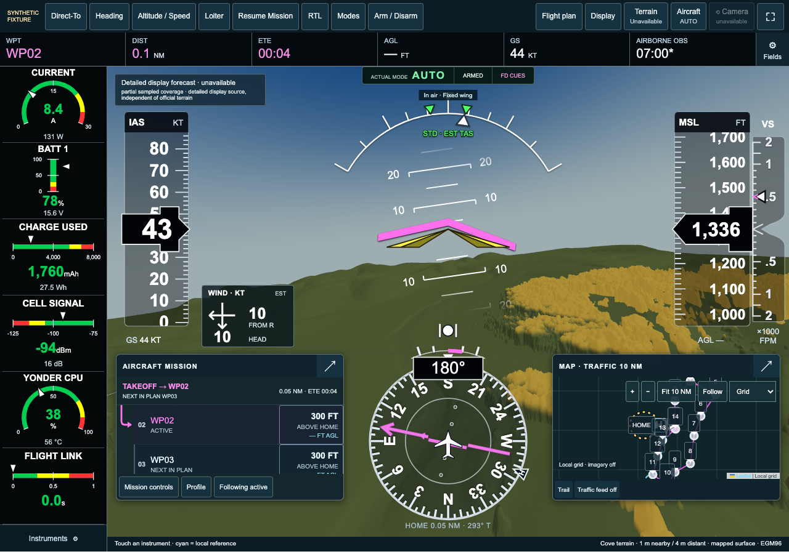

*Synthetic aircraft over the repository's surveyed USGS 2016 Cove terrain pack.
The survey and its coverage are independent of the selected cockpit layout.*

Public-data placement, offline preparation and the explicit aircraft-proxy option
are described in [Ground geographic data](cockpit-ground-data.md). Sources start
from the session's selected data options. Enable terrain,
hybrid imagery and internet traffic independently in Display & data. Executable
assets are served by the device. The grid map, mission geometry and instruments
remain useful with sources disabled or unavailable.

Offline terrain/map imports and geoid validation require **HTTPS**, or a page
served from **localhost**. For an iPad connecting to another computer, use an
HTTPS ground service; `127.0.0.1` on the iPad points to the iPad itself. A missing
secure browser context is reported as an import error and does not bypass file
integrity checks. Prepare a full offline pack with terrain drawing off, then re-enable terrain.
The headless browser exceeded the preload timeout while actively drawing detailed
terrain; device/browser performance needs its own check. Saved terrain/map packages stay in that browser's IndexedDB;
the geoid file must be loaded again in a new session.

The bundled cove pack contains surveyed bare-earth and **mapped surface** data.
Near the aircraft, the renderer retains the native one-metre grid within a bounded
nearby tile set; farther away it uses a labeled lower detail level. Survey dates,
source attribution, vertical conversion and limitations are shown in Display &
data. Missing samples remain holes. Mapped surface may include buildings and
unclassified returns; it is not a current inventory of vegetation or obstacles.
Nearby imagery is an optional visual layer and does not change elevation geometry.

With a **ground relay origin** selected, detailed terrain streams on demand; the
whole pack need not be preloaded. Visible terrain loads first. The display then
warms up to 16 native tiles along measured ground track, up to 30 seconds or
1.5 km ahead, with bounded memory. This cannot supply coverage absent from the
selected survey. **Preload terrain from ground relay** remains the explicit way
to save the complete pack for offline use. The selected relay is remembered in
this browser.

Drawing targets 60 frames per second independently of **Display telemetry updates**.
The default 4 updates per second limits flight-link traffic. Received attitude,
position and director cues are interpolated with about one observed update interval
plus a small jitter margin (bounded at 1.2 seconds); no future pose is invented.
Lost/invalid data still removes the affected indication. Cached meshes and satellite
textures survive region changes. Yellow shading eases in when new surfaces arrive;
red warning shading and numeric advisories do not wait for that visual fade.

The aircraft height datum defaults to **Unknown** because MAVLink AMSL does not
identify its geoid model. Declare EGM96, NAVD88 or WGS84 ellipsoid only from a
verified receiver configuration. Native height comparisons require compatible
references. The named Terrarium fallback can provide approximate terrain when the
pack cannot be used; it does not supply numeric AGL without a verified common
reference. Estimated ground AGL is separate from clearance over mapped objects. **EST AGL**
appears directly beneath the MSL tape. **AGL —** means fresh compatible terrain is
unavailable, including when the aircraft leaves a prepared pack's footprint.

The **Current-motion forecast** samples reported track, ground speed and vertical
speed through the selected time/distance horizon. It checks a ±20 m corridor,
with bounded sampling, and reports coverage, minimum ground/surface clearance,
closure and time to the 30 m warning or 90 m caution threshold. A partial result
does not assert that the remaining path is clear. It is a constant-motion estimate;
it does not predict autopilot turns or control the aircraft. Static terrain colors
and the future-motion forecast are separate advisories.

Traffic controls select 1–100 NM depiction range and 60, 120 or 300 second observed
breadcrumbs. Fetch coverage follows the selected 1–100 NM depiction range; a
5 NM display requests a 5 NM feed. Changing this range preserves cached map and
terrain data.
Tap the traffic status under the map to enable the feed, adjust its range and
open **Traffic data setup**. A successful search shows its observed target count
or explicitly reports no targets within the selected range. Press **Fit 10 NM**
(or the selected range) on the map to frame that area. Follow centers the aircraft
without resetting your zoom. Ground traffic refreshes every five seconds when
the provider permits, independently of the flight telemetry/display rate.
A browser-connection error can require the optional ground
relay described in [Ground data](cockpit-ground-data.md); the relay address is
remembered in this browser. HTTP 429 means the provider is rate limiting, and the
display retries after its cooldown. It never switches to the aircraft connection.
Gaps break the trail; old targets expire. Unknown target altitude or incompatible
ownship altitude keeps targets on the map. Perspective traffic requires compatible
EGM96 heights and fresh ownship pose. Provider errors, delay and attribution remain
visible. An empty display is not evidence that airspace is clear.
The traffic panel reports targets that are map-only. **Traffic data setup →
Import EGM96 geoid** loads the local altitude-conversion grid for the current page
session. Only targets with geometric altitude and inside the forward field of
view can then appear in synthetic vision; a target behind the aircraft remains
on the moving map.

## Select a camera and review calibration

Select a detected/configured camera in Display & data, then choose Camera as the
background. Automatic selection uses an identified ELP or a sole configured
camera; an arbitrary camera is not described as forward-facing. The existing
YonderPicture viewer handles connection, stale-frame reporting and frame geometry.
Capture profiles and whether streams run remain in Cameras settings. When the
selected camera is unavailable, **Use synthetic terrain** explicitly switches the
background and enables terrain. Available coverage and datum checks still apply;
the cockpit does not substitute camera registration evidence.

Camera + registered terrain adds measured scene annotations only when all required
inputs are valid: matching camera/profile calibration, lens intrinsics and
distortion, mounting transform, crop/rotation/mirroring, residual bounds, an
explicit compatible height reference, observed terrain and a bracketed pose at the
actual frame capture time. The overlay uses the displayed video rectangle.

Importing calibration JSON loads a local candidate, not timing evidence. It must
match the selected camera and capture profile, and pass the shared runtime
validator. The format is `CameraCalibration` in
[`packages/yonder-core/src/terrain/types.ts`](../packages/yonder-core/src/terrain/types.ts).
A validated geometry file cannot manufacture frame timestamps or prove a capture
clock relationship. When those inputs are unavailable, the cockpit states the
reason and keeps the screen-fixed instruments. Physical camera registration has
not been established by the synthetic browser tests.

## Development verification

The illustrated guide has an executable walkthrough. With the fixture preview
running on port 4192, run `npm run cockpit:guide -w node-red-dashboard-2-yonder`.
It checks the visible controls and captures their current appearance, then loads
the actual prepared terrain pack through a temporary ground-only relay and checks
offline reuse. It refuses a `?live=1` target and blocks aircraft HTTP requests.
See the [screenshot provenance](images/cockpit/README.md) for regeneration and the
separate explicitly enabled disposable-SITL command walkthrough.

From the repository root, `npm run cockpit:dev -w node-red-dashboard-2-yonder`
serves the real Vue widget with an explicit synthetic snapshot and in-memory
transport on loopback port 4192. The default harness cannot send an aircraft
request. `npm run cockpit:verify -w node-red-dashboard-2-yonder` checks notebook,
landscape/portrait tablet and narrow viewports using that fixture. Component and
ported instrument tests run with the dashboard package's normal test command.
The flight workflow checks are in `flight-workflow.test.ts`,
`flight-controls.component.test.ts`, and `flight-host.component.test.ts` beside the
cockpit components. They cover actual/request separation, stale context, mission
conversion, map target selection and one confirmed send. Interactive fixture
checks covered 1280×720 laptop layouts in both palettes, a 768×1024 tablet and a
390×844 narrow viewport. These checks do not establish physical-flight behavior.

For real geography with synthetic flight data, run
`node scripts/cockpit/data-preview.mjs --public-data`, then start the cockpit
harness with `COCKPIT_API=http://127.0.0.1:4194` and open `/?live=1`. The preview
service refuses aircraft writes. Public data is enabled only by the explicit
flag. This verifies native pack/imagery/traffic rendering separately from MAVLink
SITL and physical camera/aircraft evidence.

## Native ArduPlane SITL walkthrough

Build `yonder-core`, then start
`node scripts/cockpit/sitl-preview.mjs --firmware-dir DIR --public-data`.
The script verifies the pinned official ArduPlane 4.7.1 files and owns an isolated
port-5766 container. Firmware acquisition and checksums are documented in
[`scripts/cockpit/README.md`](../scripts/cockpit/README.md). It sends no automatic
aircraft command and leaves an existing port-5762 simulator untouched.

Start `COCKPIT_API=http://127.0.0.1:4195 npm run cockpit:dev -w node-red-dashboard-2-yonder -- --port 4193`
and open the loopback port-4193 page with `/?live=1`. This mounts the production
Vue cockpit and production command service against the isolated simulator.

Read the aircraft mission first. For a fresh simulator, a verified empty read plus
actual HOME_POSITION permits the first upload. Load the cove example as a local
draft, review it, and confirm upload. Wait for verified readback. Arming and mission
start are separate explicit actions, each requiring review and confirmation.
Closing the preview script cleans up its own container. These steps establish
simulator evidence; they do not establish physical camera or aircraft readiness.
