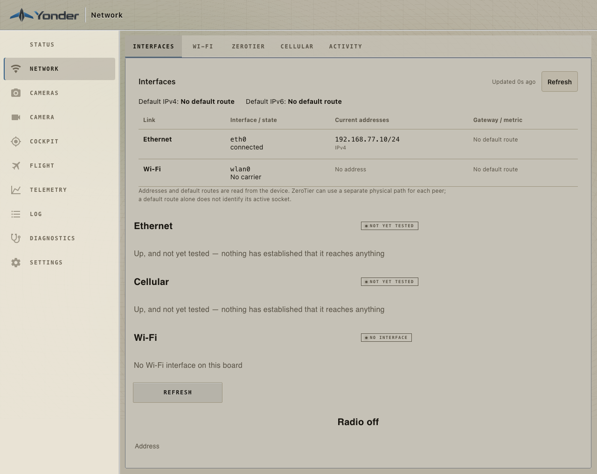
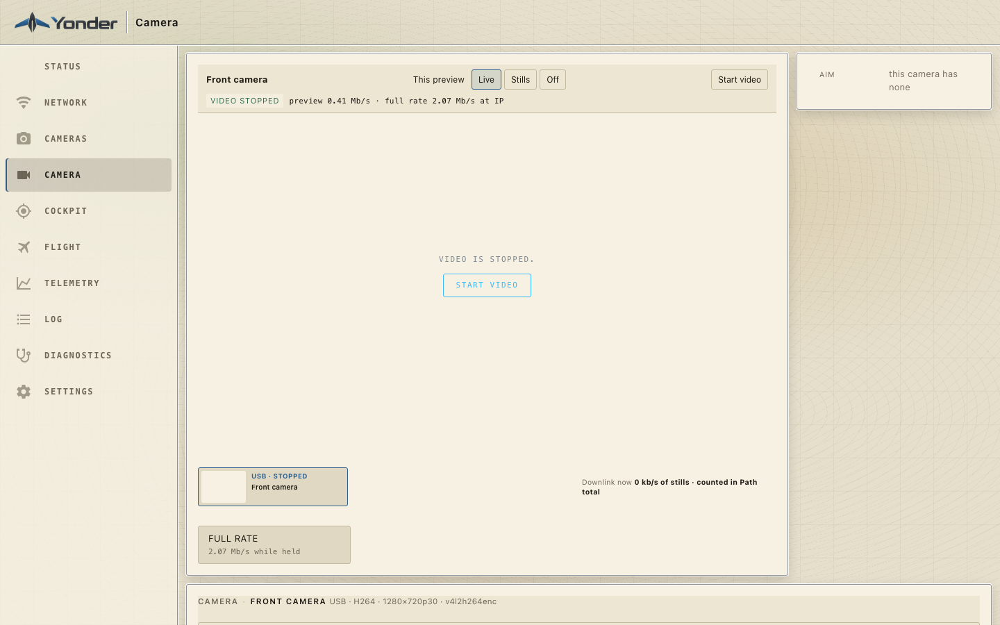
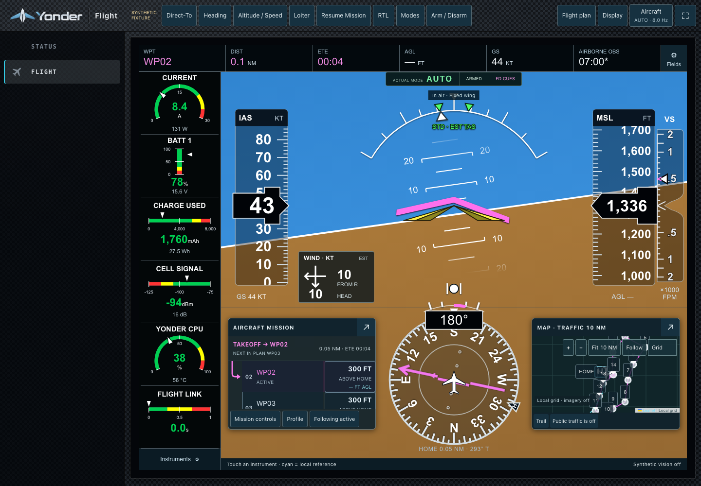
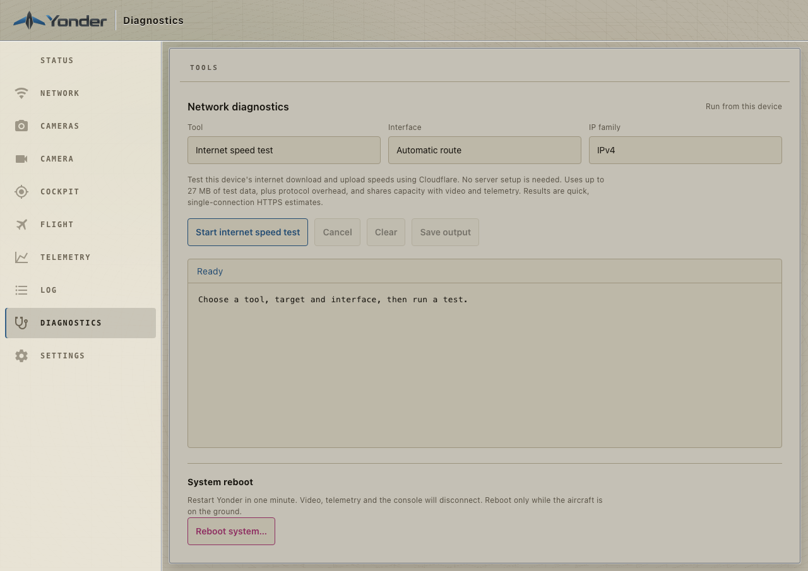
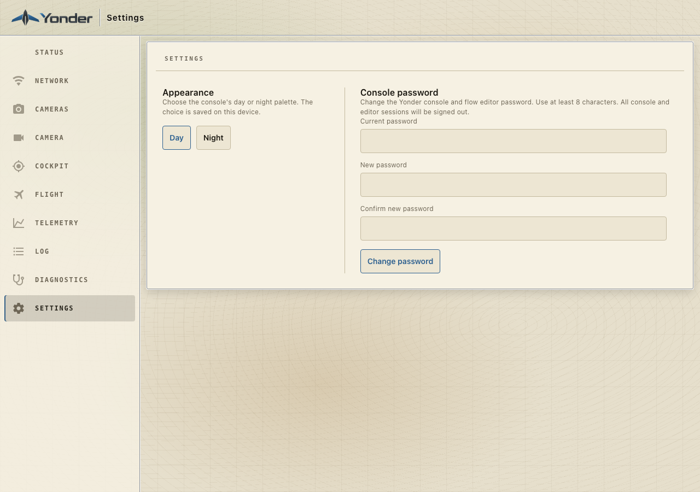

# Using Yonder

[Project overview](../README.md) · [Install Yonder](getting-started.md) ·
[Tested hardware](hardware.md) · [Illustrated Flight guide](cockpit-user-guide.md)

Yonder puts the companion board, aircraft telemetry, cameras, and network paths
in one console. This guide is the starting point for everyday use after
[installation and first login](getting-started.md#7-your-first-session).

## Find your way around

| Page | Use it for |
| --- | --- |
| **Status** | Board condition, current interface addresses, telemetry summary, reachability and remote status |
| **Network** | Interfaces, Wi-Fi, ZeroTier, cellular configuration and connection activity |
| **Cameras** | Discover, configure, select, or forget a camera |
| **Camera** | The selected camera’s picture, aim, capture, image controls, stream settings and connection details |
| **Cockpit** | The camera picture and aim controls on their own |
| **Flight** | Aircraft PFD/MFD, instruments, mission, map/terrain and reviewed flight actions |
| **Telemetry** | Flight-controller detection, telemetry destinations, start/stop and path diagnosis |
| **Log** | Device activity and reasons for recent changes |
| **Diagnostics** | Internet speed test, ping, traceroute, route lookup, bandwidth test and guarded reboot |
| **Settings** | Day/Night appearance and the console administrator password |

The header identifies the page. **Cockpit** and **Flight** are different surfaces:
one is the camera view; the other is the aircraft flight display.

## Read what the device actually knows

A configured destination is not proof of a working link. Look at observed state,
last-heard times, current addresses, and the explanation beside an unavailable
control. A blank value, missing sensor, stale sample, failed read, and stopped
camera have different meanings; do not read an absent value as zero.

Status and Network share the current interface observations. The Flight display
can inspect telemetry sources and freshness. Camera readbacks distinguish an
applied request from what the device or receiver has actually reported.

## Apply, Keep, Revert, and immediate controls

Yonder uses three kinds of action:

- **Local display changes** affect your browser or its preview, such as a Flight
  layout or turning your local camera preview Off. They do not command the aircraft.
- **Immediate device controls** act when pressed or changed. Native camera
  controls, camera Start/Stop, and recording are examples; read the control’s
  state and result.
- **Staged configuration changes** first alter a draft. **Apply** sends it;
  **Discard** removes edits that have not been applied. A risky applied change
  gets a deadline, with **Keep** and **Revert** shown inline.

Keep means the new configuration works for you. Revert restores the previous
configuration. If a change that requires confirmation is left alone, its timer
reverts it. Some changes, including the palette, are kept without a confirmation
window. A Wi-Fi join has its own reachability check because the radio carrying
your browser may move; read the pending message and reconnect as instructed.

The rollback applies to configuration. It is not a software-update rollback or a
substitute for board recovery when the OS, power supply, or SD card has failed.

## Network and remote access


*Production console, fixture board, Day palette.*

### Ethernet and Wi-Fi

Use **Network → Interfaces** to see interface state, IPv4/IPv6 addresses, and
observed default routes. Refresh requests another read. An interface address
alone does not prove internet access, and a stale reading is marked accordingly.

Use **Network → Wi-Fi** to scan and join an existing network. The local access
point may disappear when the same radio becomes a Wi-Fi client. Rejoin the LAN
and find the board by its current address or, where supported, `yonder.local`.
If the attempted path does not work, the configured fallback can restore the AP.

The default preference is Ethernet, cellular, then Wi-Fi client. The page shows
what the kernel is actually using, which can differ from a preference while a
link is absent or unavailable. Advanced settings are documented in the
[configuration reference](configuration.md).

### Cellular

Open **Network → Cellular**. Check that the modem is present, the SIM is usable,
and registration/signal are reported. Enter the carrier’s APN and any required
credentials, then apply the change and inspect its result. Do not guess an APN
from the modem manufacturer’s name.

The tested EC25 uses ModemManager/MBIM. Other USB compositions and modem-as-router
hardware need their own preparation. A registered modem still needs an address,
route and working data path. Use Diagnostics to separate those questions.

### ZeroTier

Create or choose a ZeroTier network, join it from **Network → ZeroTier**, and
authorize the Yonder member in that network’s controller. Join and authorize your
ground computer on the same network. Then open Yonder at its assigned mesh
address and configured console port, normally 3000.

Both ends need the appropriate ZeroTier client/network membership. The mesh
handles private addressing through networks such as cellular CGNAT; it does not
create coverage where the modem has none.

“Controller path” and “Controller latency” describe Yonder’s measured controller
connection. They are not a measurement of every ground-station peer. A virtual
ZeroTier address is not the physical Ethernet/Wi-Fi/LTE path carrying a peer.
For a specific path, use its physical peer endpoint with Route lookup and inspect
the results. [Detailed network behavior](hardware/network-diagnostics.md).

Tailscale integration is not currently available in the console.

## Telemetry and ground stations

Connect the controller using the [tested wiring and OS preparation](hardware.md#flight-controller-and-ground-stations).
Its chosen port must provide MAVLink at the configured/detected rate.

Open **Telemetry** and inspect:

1. The detected controller, port, baud rate, heartbeat and last-heard time.
2. The telemetry sending state and whether autocast is enabled at boot.
3. Each ground station’s address/port and whether it is answering.
4. The path check’s separate aircraft→Yonder, Yonder→station, and station→Yonder observations.

Set up to three UDP destinations for your actual ground computers and configure
the receiver to listen on the corresponding port. **Send telemetry here** uses
the console session’s supported destination workflow; verify the resulting
address when using proxies, VPNs, or another network.

**Start/Stop telemetry** changes ground-station forwarding. Stopping forwarding
is distinct from stopping the controller’s link to Yonder. **Look again now**
re-detects the controller and interrupts telemetry while it does so; use it when
that interruption is acceptable.

Opening MAVLink acceptance to **Any network** changes exposure of the receiving
path and uses Apply/Keep/Revert. The TCP server is reported as unavailable when
the current ingest policy does not permit a listener. Copy the displayed
settings into your ground station rather than assuming a port is listening.

## Cameras and video


*Production camera workspace with a stopped UVC fixture camera. No live camera
or flight is implied by this capture.*

### Find the camera and start a picture

Use **Cameras** to discover attached hardware. Configure a detected camera,
choose its name, and open **Camera**. A remembered camera that is unplugged is
shown as absent; forgetting its configuration is a separate action.

**Start video**, **Stop video**, and **Retry** follow the observed lifecycle.
Wait for a running state and a decoded browser picture. The camera controls
remain on one page: image/capture controls followed by stream, picture, and
output settings. Errors and operation results appear inline.

### Browser preview and ground-station stream

The browser preview and full stream have independent settings. A browser’s
**Live / Stills / Off** choice is local: Off does not stop the camera for another
viewer or a ground station. **Full rate** is a held preview request with its
bandwidth cost shown beside it.

Start with H.264 when checking compatibility. H.265 is offered only where the
board can encode it; browser preview also depends on browser reception support.
Changing the main codec does not silently change the preview codec.

Choose **Fixed** for a fixed target, or **Adaptive** with an appropriate floor
and ceiling. Adaptation uses the supported receiver-delivery observations;
missing or stale feedback is not evidence of spare capacity. Read the reason
shown beside an unavailable feedback state. Settings should reflect your real
link budget, including every viewer and output.

Open **Connection details** for stable camera identity and copyable receiver
settings, including supported RTSP/ground-station forms and reachability reasons.
Enable the desired output, Apply and Keep it when required, and verify reception
at that ground station. Treat credential-bearing stream addresses as private.

### Image controls, recording, and aim

Camera image controls show their own readbacks. An automatic mode may govern a
manual value; a device without a control says so. Stream color processing is
separate from native camera controls and may add processing work.

Recordings and photos go to the destination the page identifies. Board captures
use board storage; Pocket 2 native captures use its card. Inspect available
space, the result, and the saved item. Thumbnail stills are RAM previews, not
native Pocket photo commands.

A supported gimbal has one **Aim** panel. Slew requires fresh operator intent;
release ends that intent. The picture’s gesture control and the panel follow
the same camera lifecycle. Native position feedback, available modes, and
bounded presets depend on the measured camera integration. Do not infer joint
travel from the aircraft’s world-attitude angles.

The Pocket 2 requires USB gadget-mode preparation on the Pi. The SeekerHD
requires the Radxa sensor/ISP stack. Follow the [camera hardware notes](hardware.md#cameras)
before expecting either to behave like a generic UVC camera.

## Flight


*Demonstration telemetry in the production Flight widget.*

Start with the [illustrated Flight walkthrough](cockpit-user-guide.md#how-to-use-it).
It covers the PFD, configurable instruments and layouts, missions, controller
home, Direct-To/heading/altitude requests, maps, terrain, traffic, and breadcrumbs.

A local reference or draft mission is not a command to the aircraft. Read the
command review, check the selected aircraft and requested action, then explicitly
confirm when you intend to send it. The result distinguishes a request, an
acknowledgement, and observed controller behavior. ArduPilot owns execution and
its flight protections.

Data availability matters. A local terrain pack, online map imagery, received
traffic, and onboard sensors are independent inputs. Configure them using
[Ground data setup](cockpit-ground-data.md). The default route for optional
internet data is the ground browser; an aircraft relay is a separate explicit
choice that consumes the aircraft’s link.

To learn without a board, use the [synthetic preview or isolated simulator](#try-the-interface-without-an-aircraft).
The simulator walkthrough is identified as such and does not establish physical
flight acceptance.

## Diagnostics and recovery


*Fixture console; no public speed test was run to make this screenshot.*

Choose a tool, interface and IP family, then start it. Output is plain text you
can inspect, cancel, clear or save. **Route lookup** explains the kernel’s route;
**Ping** and **Traceroute** test different parts of reachability. Advanced bandwidth
uses an iperf3 server you provide.

The one-click **Internet speed test** uses Cloudflare’s public endpoints. It
needs internet access, transfers up to about 27 MB of synthetic payload plus
protocol overhead, and shares capacity with video and telemetry. Run it when
that traffic is acceptable. Its short single-connection estimate is not a
promise of sustained cellular capacity.

The **Reboot system** control requires explicit confirmation and checks its
current refusal conditions. Reboot interrupts the console, video and telemetry.
Use a bench maintenance session; a reboot cannot fix missing power or an
incorrectly prepared OS by itself.

For a lost console, check its current LAN/mesh address and the fallback AP.
Then use [installation troubleshooting](getting-started.md#if-something-does-not-work).
The **Log** page provides device-level events; service journals provide deeper
OS/startup evidence when SSH or a local terminal is available.

## Settings and passwords



**Settings → Appearance** changes the device console’s Day/Night palette. The
Flight display also has its own display preferences, described in its guide.

To change the console password, enter the current password and the new password
twice. A successful change invalidates existing console/editor sessions.
Sign in with the new password. This does not change the OS/SSH account, the
access-point passphrase, a camera’s stream credential, or ZeroTier membership.

The flow editor is an advanced configuration surface, available only where
configured. Normal use of the pages above does not require opening it.

## Try the interface without an aircraft

After cloning the repository and running `npm ci` and `npm run build`:

```sh
npm run cockpit:dev -w node-red-dashboard-2-yonder
```

Open the local address printed by Vite, normally `http://127.0.0.1:4192`.
The **synthetic fixture** uses example telemetry and an in-memory command
collector. It is for learning the display, not testing an installed board.

For a disposable ArduPlane/QuadPlane simulator with the real command service,
follow [Native cockpit previews](../scripts/cockpit/README.md) and the
[Flight simulator walkthrough](cockpit-user-guide.md#native-arduplane-sitl-walkthrough).
Those instructions identify their downloaded firmware, ports, source mode and
explicit command steps.

## Keep the installation understandable

Record the version shown on Status, your board/OS and hardware, and changes you
make. Keep exported mission plans and configuration backups private. Read
[versioning and upgrades](versioning.md) before installing another build.
When reporting an issue, include observed states and redacted output rather than
passwords, stream credentials, or `secrets.yaml`.
